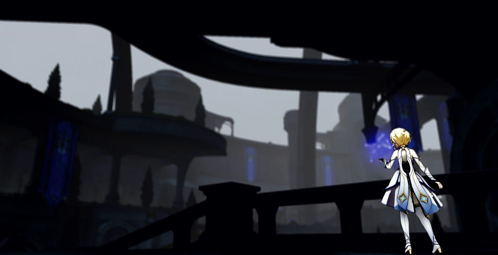

  <h1 class="header">HoYoShade</h1>
  <h3>
    Reaching the peak of perfection together to see the Milky Way.
  </h3>

  

EN|简体中文|繁體中文

## 〢 Directory

- [Introduction](#〢-Introduction)
- [Information](#〢-Information)  
- [Sources](#〢-Sources)
- [Requirements]()
- [Supported systems]()
- [How to install]()
- [Tested game versions]()
- [Recommended settings for game]()
- [Screenshots]()
- [Legend]()
- [Contributors]()

## 〢 Introduction

A Unofficial ReShade For All HoYoVerse Games on PC.

The working principle of Reshade is to intercept communication between the CPU and GPU and modify image information to improve image quality. This repository's ReShade integrates some open-source projects based on the official ReShade (for the specific list please check the [Sources Page](#〢-Sources)), making it compatible with all HoYoVerse games on PC and creating some targeted presets. In the future, it will support more HoYoVerse games.

Please refer to the [Contributors Page]() for information about contributors to this repository.

## 〢 Information

The Genshin Impact game in mainland China has strengthened its identification of mods and cheats by connecting to Tencent's anti-cheating system. This means that any mods or cheats are more likely to be identified by HoYoVerse,
and consequently, your account is more likely to be banned or face other serious consequences. 
No mod or cheat can guarantee the absolute safety of your game account. 
Although HoYoShade can run on the official servers of HoYoVerse games,
it does not guarantee the absolute safety of your game account. 

Contributors to the HoYoShade repository and all contributors who have developed based on HoYoShade will not be responsible for any consequences that may occur when running HoYoShade on the official servers of HoYoVerse games.

Before sharing game content with anyone else or streaming, HoYoShade recommends using other mods to hide your game UID and user information, and not to display HoYoShade or other mod interfaces to anyone else.

In addition, HoYoShade recommends updating your graphics card and chipset drivers to the latest version (if available) to minimize graphics-related issues and prevent game crashes, and to receive the latest support from your device manufacturer.

## 〢 Sources

| Name | information | URL address |
| --- | --- | --- |
| ReShade Official | Always the latest Version | [Official Repository](https://github.com/crosire/reshade),[Official Website](https://reshade.me/) |
| Crosire's DLL injector | Just an injector | [View source code in ReShade Official Repository](https://github.com/crosire/reshade/blob/main/tools/injector.cpp) |
| All Paid ReShade-Shaders by Pascal Gilcher| Available for all HoYoShade V2.X.X Version for free | [View his Patreon Page](https://www.patreon.com/mcflypg/posts) |
