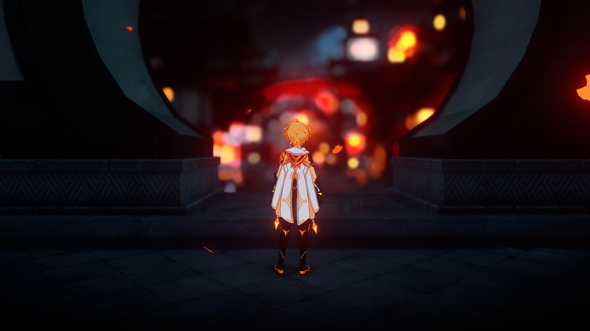
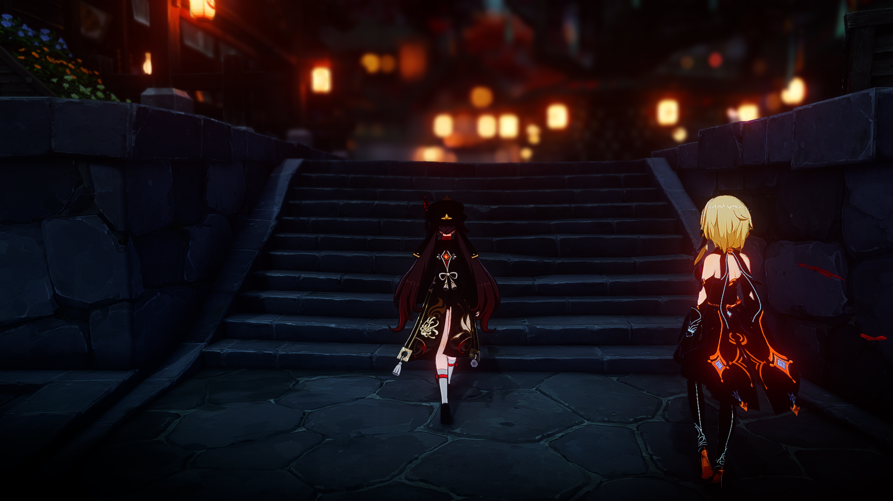
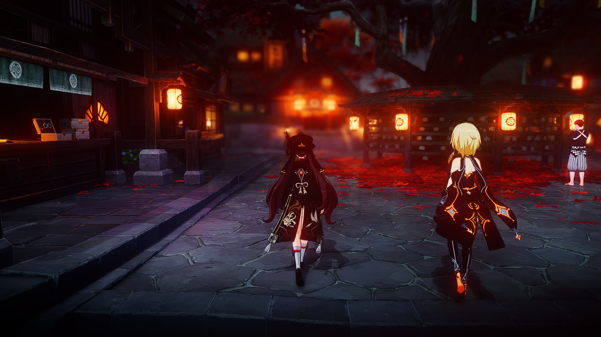
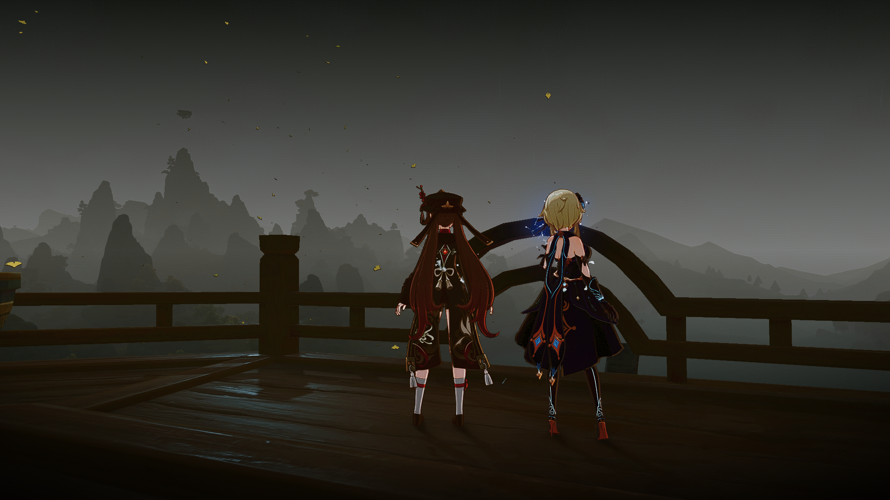
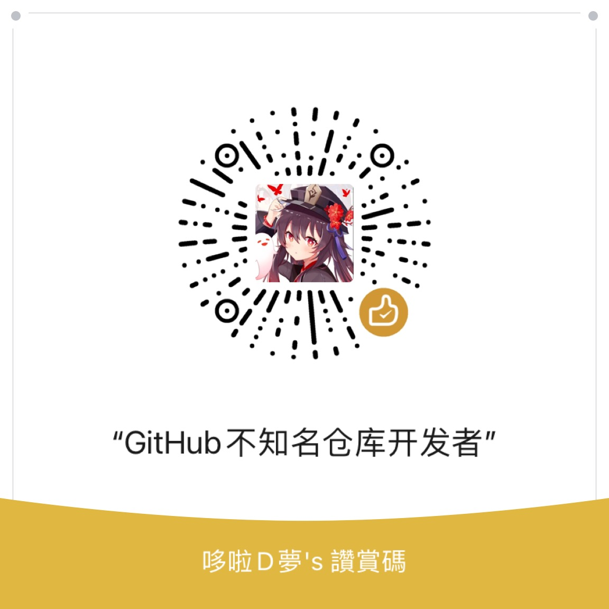

# Reshade_For_HoyoVerse_Games 

Gitee鏡像倉庫名：Reshade_For_MiHoYo_Games  
這是一個非官方Reshade，使其能在突破米哈遊對於官方Reshade的封鎖下正常用於原神和崩壞:星穹鐵道(其它米哈遊遊戲未測試)    

## 用您最擅長的語言閱讀 ReadMe.md  
[英语/英語/English](README.md)  
[简体中文/簡體中文/Chinese_Simplified](README.Chinese_Simplified.md)  
你現在正在查看的：[繁体中文/繁體中文/Chinese_Traditional]  

## 重要信息!!!  
如果您居住在中國大陸或者無法訪問 github.com  
您可以訪問Gitee上的[鏡像倉庫](https://gitee.com/DuolaD/Reshade_For_MiHoYo_Games).   
當此存儲庫在 Github 中更新時，Gitee 將在 30 分鐘到 1 小時後自動更新。

如果你現在訪問Gitee上的鏡像倉庫，可以嘗試訪問[Github上的主倉庫](https://github.com/DuolaD/Reshade_For_HoyoVerse_Games).  
GitHub的更新速度總是比Gitee快。

## 目錄
- [簡介](#簡介)  
- [關於原作者](#關於原作者)  
- [注意](#注意)  
  - [關於中國大陸服原神](#關於中國大陸服原神)  
- [怎样才能使用这个模组](#怎樣才能使用這個模組)  
- [模組效果展示](#模組效果展示)
  - [視頻](#視頻)
- [顯卡配置要求](#顯卡配置要求)
- [Readme更新日誌](#Readme更新日誌)
- [模組更新日誌](#模組更新日誌)
- [赞助我](#贊助我)  
- [聯繫我](#聯繫我)  

## 簡介  
這是一個非官方Reshade，使其能在突破米哈遊對於官方Reshade的封鎖下正常用於原神和崩壞:星穹鐵道(其它米哈遊遊戲未測試)  
米哈遊在原神1.1版本之後就封鎖了官方Reshade  
並且如果在原神1.1之後的版本在遊戲根目錄下安裝官方Reshade並啟動遊戲，遊戲會拒絕加載Reshade  
因此就需要一個注入式的Reshade來突破米哈遊的封鎖並運行Reshade  

## 關於原作者  
原文件來自嗶哩嗶哩UP主分享的給原神安裝Reshade教程。基於這個文件，我對Reshade進行了一定程度的修改。  
但原文件Reshade Unofficial的原作者並沒有在文件中留下自己的名字。  
如果您知道原作者是誰，或者您是原作者，請聯繫我。  
如果您（原作者）覺得該倉庫冒犯了您，請聯繫我，我將向您道歉並承諾刪除該倉庫。  
郵箱：D_mou@outlook.com  

## 注意
我不建議你在米哈遊官方服務器上運行這個模組，儘管它可以在官方服務器上運行。  
事實上，無論你安裝哪個模組，都有可能被米哈遊檢測到並封禁賬號。  
如果您實在害怕被米哈遊封禁賬號，請自行搭建私人服務器。  
如果您選擇在官方服務器上運行本模組，請對您的行為後果負責。本人不會對封號造成的損失承擔任何責任。  

### 關於中國大陸服原神   
順帶一提，中國大陸服原神在2.8版本時就接入了騰訊反作弊系統。  
這意味著所有模組都會更容易被米哈遊檢測  
還是和我上面所說的一樣：請對您的行為後果負責。本人不會對封號造成的損失承擔任何責任。  

## 怎樣才能使用這個模組  
從[本倉庫的發行頁面](https://github.com/DuolaD/Reshade_For_HoyoVerse_Games/releases/tag/Publish)下載最新的zip包並解壓  
然後按照zip壓縮包內的教程操作即可  

## 模組效果展示    
以下所有圖片和視頻全部使用的是[本倉庫的發行頁面](https://github.com/DuolaD/Reshade_For_HoyoVerse_Games/releases/tag/Publish)壓縮包裡的"Film Night.ini"預設  
並且同時使用了[GIMI模組注入器](https://github.com/SilentNightSound/GI-Model-Importer)和[Remove UI](https://gamebanana.com/mods/424034)來隱藏UI

### 視頻  
晚些時候我會將視頻上傳到Youtube  
當你點擊下面的鏈接時，網頁會重定向至快手(中國內地一個短視頻平台，類似抖音(TikTok))  
[Video1](https://v.kuaishou.com/WKblMb).  
[Video2](https://v.kuaishou.com/XjxMep).  

## 顯卡配置要求  
最低配置：GTX 1060 - 6GB 或同級別AMD顯卡  
畫質調節建議：高畫質，抗鋸齒改為FSR  
此硬件和畫質設置下，在絕大多數場景穩定60FPS，深淵開啟FPS解鎖器後一般都在50~80FPS，使用"Film Night.ini"預設可以在30FPS左右的情況下運行  

推薦配置：RTX 2060 或同級別AMD顯卡及以上(不包括RTX3050)  
畫質調節建議：無腦全部選項設置為最高  
此硬件和畫質設置下，遊戲可以穩定60FPS，開啟FPS解鎖器後一般都在120FPS，使用"Film Night.ini"預設"預計"可以在60FPS左右的情況下運行   

需要注意的是，RTX3050的性能在最低配置要求和推薦配置要求之間  
RTX3050 = GTX1660S + RTX + DLSS3  

## Readme更新日誌  
- 2023/07/02  

*修改了所有語言版本的ReadMe.md文件的MarkDown語法錯誤。  
*使用了ChatGPT和Grammarly更正英語版ReadMe.md文件的翻譯錯誤和語法錯誤（感謝OpenAI）。  
*增加了Readme.md更新日誌,模組更新日誌和讚助詳情  

## 模組更新日誌 
- 2023/07/02  更新至V1.1.0  
*重大更新：此版本涵蓋了本人自費購買的RTGI光追包。換句話說，V1.1.0現已支持光線追踪！  
*增加了更多的Reshade預設可供遊玩  
*將原本V1.0.0的.ps1啟動方式改為了使用.bat的形式啟動注入程序  
*解決了由於OEM電腦無法更改Powershell組策略而導致的無法正常啟動注入程序  

- 2023/07/09  更新至V1.1.1  
*更新了一下教程，添加了一些常見問題，更改了現版本注入器的使用方式  

## 贊助我  
如果你可以使用微信支付，你可以使用微信掃描這個二維碼對我進行贊助。  
贊助的金額由你自行設定。  
  
由於我沒有Visa/萬事達銀行卡和PayPal  
因此暫時沒有辦法支持其它支付方式進行贊助  

## 聯繫我  
請記住，如果你在使用此模組時有任何的問題，請先在本倉庫創建一個issue。  
我的個人郵箱地址:D_mou@outlook.com  
[我的國際米遊社賬號(不是中國大陸米遊社)](https://www.hoyolab.com/accountCenter/postList?id=192633110).  
