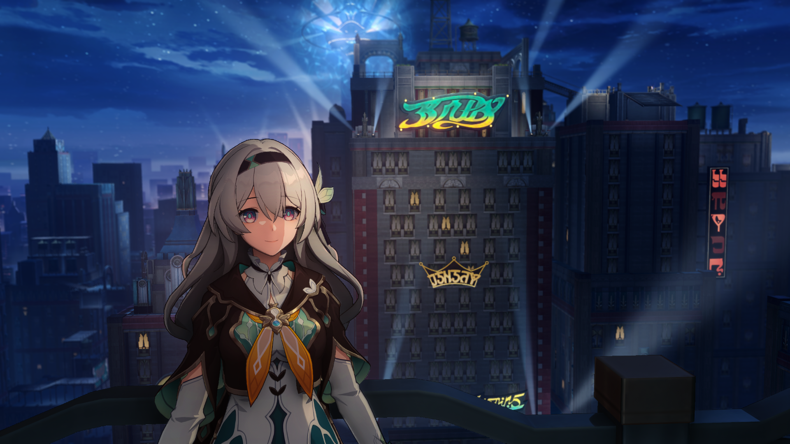

  <h1 class="header">HoYoShade</h1>
  <h3>
    登峰造极，终抵银河。
  </h3>

  

[EN](Readme.md)|**简体中文**|[繁體中文](Readme.Chinese_Traditional.md)  

> [!NOTE]
> ·我们深知您可能熟悉第二语言。但如果你来自于中国大陆地区,我们更加推荐你去阅读[简体中文版本的Readme.md](Readme.Chinese_Simplified.md)来获得更多有关于原神原神无人机的信息。  
> ·翻译并非100%准确，翻译工作主要基于OpenAI-GPT4o，谷歌翻译和本人的校对组成。 但即使如此，最终成品也难免会产生一定的问题。 如果你发现或者你认为这是一个问题，请提交issues以帮助HoYoShade改进。  
> ·正在寻找旧版本吗？我们正在开发 [HoYoShade-RePublish](https://github.com/DuolaD/HoYoShade-RePublish) 仓库。完成后，您可以下载所有旧版本的Release，听起来不错？当然，重新发行的内容肯定会移除全部受到DMCA警告的内容的。  
> ·由于HoYoShade收到了DMCA警告，你无法再从Release界面下载低于V2.013.0 Stable版本的HoYoShade。有关详细情况，请查看[关于DMCA](#〢-关于DMCA)界面。  

## 〢 视频演示

  <h1 class="header">Shot by AXBro阿向菌</h1>
  <h3>
    Night,Diluc 雨夜，迪卢克实拍短片
  </h3>
  点击下方图片在观看:

或者点击此按钮：

> [!NOTE]
> · 截图展示所使用的预设/效果库可能经过了用户自行添加/编辑。  
> · 本视频中使用的其他模组未在中国大陆以外的地区发行，且 HoYoShade 不包含这些附加功能。  
> · 哔哩哔哩提供4K播放选项，如果你身处中国大陆，我们推荐你使用哔哩哔哩进行播放。  

## 〢 目录

- [**介绍**](#〢-介绍)
- [**警告**](#〢-警告)
- [**支持游戏列表**](#〢-支持游戏列表)
- [**来源**](#〢-来源)
- [**OpenHoYoShade和HoYoShade**](#〢-OpenHoYoShade和HoYoShade)
- [**如何安装?**](#〢-如何安装)
- [**推荐游戏图像设置**](#〢-推荐游戏图像设置)
- [**截图展示**](#〢-截图展示)
- [**关于DMCA**](#〢-关于DMCA)
- [**鸣谢**](#〢-鸣谢)
- [**赞助**](#〢-赞助)
- [**联系我**](#〢-联系我)
- [**贡献者**](#〢-贡献者)

## 〢 介绍

这是一个非官方Reshade，使其能在突破米哈游对于官方Reshade的封锁下正常用于所有可在PC端运行的米哈游游戏。

ReShade的工作原理是拦截CPU和GPU之间的通信，并修改渲染信息以达到提高图像质量的目的。HoYoShade集成了一些基于官方ReShade的开源项目(具体列表请查看[来源页面](#〢-来源))并对其进行修改，使其与PC上所有的米哈游游戏兼容，并制作一些有针对性的预设。未来，它将支持更多的米哈游游戏。

有关本仓库贡献者的信息，请访问[贡献者界面](#〢-贡献者)

## 〢 警告

> [!Warning]
> ·中国大陆服原神由于对接了腾讯的反作弊系统，并且针对性加强了对于模组识别。所以任何模组及外挂均有更大可能被米哈游识别，这也意味着你的账号更有可能会被封禁或导致其它严重后果。没有任何模组和外挂可以保证你的游戏账号可以绝对安全。HoYoShade虽然可以运行在官方服务器的米哈游游戏上，但并不保证你的你的游戏账号绝对安全。如果您担心您的游戏账号会被封禁，请考虑搭建私服。  
> ·在你将游戏内容发送至其它任何人或者进行直播之前，HoYoShade建议你先使用其它Mod隐藏游戏UID和用户信息，并且不要将HoYoShade及其它模组界面展示给其它任何人。

> [!NOTE]
> ·HoYoShade建议你将你的显卡和芯片组驱动更新至最新版本（如果可用），以获得来自你设备制造商的最新支持以尽可能减少与图形相关的问题，降低游戏崩溃的几率，并获得来自设备制造商的最新支持。  
> ·我们不建议你在官方服务器上运行HoYoShade。  
> ·我们不建议你使用Beta(测试服)客户端在官方服务器中运行HoYoShade，以免对HoYoShade全体开发者/全体二创开发者和你本人造成保密协议违约/违规/违法/经济损失等风险。  
> ·对于可能会发生的任何后果，HoYoShade全体开发者/全体二创开发者均不会承担任何责任。  

## 〢 支持游戏列表
  
公开(REL)客户端：  
  
> [!NOTE]
> ·对于私服玩家来说，如果私服所需的对应客户端出现在下方支持的游戏列表中，则说明HoYoShade可以提供支持。  
> ·我们不建议你在官方服务器上运行HoYoShade。  
> ·对于并未出现在支持游戏列表中的游戏，你可以自行尝试选择使用注入器中已支持的游戏/在开发者选项中选择自定义注入来尝试注入HoYoShade。  
> ·HoYoShade支持同时与其它主流Mod一并注入，且不存在任何冲突问题。但请注意并确保其它游戏Mod之间不会有冲突（例：原神无人机与GIMI，3DMingo和甜瓜）。  
> ·原神无人机在每次原神游戏版本更新后均需要等待适配
  
| 客户端 | 是否已测试 | 是否支持 | 是否存在游戏版本限制 |
| --- | --- | --- | --- |
| **原神/YuanShen/Genshin Impact(中国大陆服/天空岛)** | 是 | 是 | 无游戏版本限制 |
| **原神/YuanShen/Genshin Impact(哔哩哔哩服/世界树)** | 是 | 是 | 无游戏版本限制 |
| **原神/YuanShen/Genshin Impact(国际服)** | 是 | 是 | 无游戏版本限制 |
| **原神/YuanShen/Genshin Impact(Epic版本)** | 是 | 是 | 无游戏版本限制 |
| **崩坏3/BH3/Honkai Impact 3rd(中国大陆服)** | 是 | 是 | 无游戏版本限制 |
| **崩坏3/BH3/Honkai Impact 3rd(中国大陆Steam服)** | 是 | 是 | 无游戏版本限制 |
| **崩坏3/BH3/Honkai Impact 3rd(繁中服)** | 是 | 是 | 无游戏版本限制 |
| **崩坏3/BH3/Honkai Impact 3rd(韩国服)** | 是 | 是 | 无游戏版本限制 |
| **崩坏3/BH3/Honkai Impact 3rd(日本Steam服)** | 是 | 是 | 无游戏版本限制 |
| **崩坏3/BH3/Honkai Impact 3rd(东南亚服)** | 是 | 是 | 无游戏版本限制 |
| **崩坏3/BH3/Honkai Impact 3rd(欧美服)** | 是 | 是 | 无游戏版本限制 |
| **崩坏:星穹铁道/HSR/Honkai: Star Rail(中国大陆服)** | 是 | 是 | 无游戏版本限制 |
| **崩坏:星穹铁道/HSR/Honkai: Star Rail(哔哩哔哩服)** | 是 | 是 | 无游戏版本限制 |
| **崩坏:星穹铁道/HSR/Honkai: Star Rail(国际服)** | 是 | 是 | 无游戏版本限制 |
| **崩坏:星穹铁道/HSR/Honkai: Star Rail(Epic版本)** | 是 | 是 | 无游戏版本限制 |
| **绝区零/ZZZ/Zenless Zone Zero (中国大陆服/国际服客户端)** | 是 | 是 | 无游戏版本限制 |
  
内测(CB/CBT)客户端:    
  
> [!NOTE]
> ·对于私服玩家来说，如果私服所需的对应客户端出现在下方支持的游戏列表中，则说明HoYoShade可以提供支持。  
> ·MiHoYo/HoYoVerse在公测后面向测试者的Beta版(测试服)客户端通常客户端版本号为:X.5.X，X.X.Y(此处的X为现行REL(公测/公开)版本号)，X.X.Y0(此处的X为现行REL(公测/公开)版本号)等，且通常会在文件加密/启动器中有别于REL(公测/公开)客户端，请自行甄别你所持有的客户端的版本及来源。  
> ·HoYoShade理论上也可以对Beta版(测试服)客户端提供注入和运行支持，但我们对任何测试服客户端的注入和运行支持不作成功性/功能性保证。  
> ·我们不建议你使用Beta客户端在官方服务器中运行HoYoShade，以免对HoYoShade全体开发者/二创开发者和阁下本人造成保密协议违约/违规/违法/经济损失等风险。  
> ·除非下列表格中的选项为"是"，否则这说明HoYoShade仅对该类型下被泄露出来的部分客户端进行了测试并得出了支持的结论。这不代表所有版本/类型/来源的不同游戏的内测客户端均可运行HoYoShade，请自行测试。  
> ·如果你正在使用的测试服客户端并不支持运行HoYoShade，并且你非常确定这并非是使用了错误的注入选项导致的问题，请在[issues界面](https://github.com/DuolaD/HoYoShade/issues)新建issues以帮助我们适配。或者使用启动器的开发者功能尝试自定义注入。  
> ·对于并未出现在支持游戏列表中的游戏，你可以自行尝试选择使用注入器中已支持的游戏/在开发者选项中选择自定义注入来尝试注入HoYoShade。    
> ·原神无人机不可用于任何测试服客户端。  
  
| 客户端 | 是否已测试 | 是否支持 | 是否存在游戏版本限制 |
| --- | --- | --- | --- |
| **原神/YuanShen/Genshin Impact(海外 部分公测前内测客户端)** *1 | 已在部分被泄露的客户端测试 | 已在部分被泄露的客户端中测试并支持 | - |
| **原神/YuanShen/Genshin Impact(中国大陆 全部公测前内测客户端)** | 已在部分被泄露的客户端测试 | 已在部分被泄露的客户端中测试并支持 | - |
| **原神/YuanShen/Genshin Impact(中国大陆/海外 公测后内测客户端)** | 已在部分被泄露的客户端测试 | 已在部分被泄露的客户端中测试并支持 | - |
| **崩坏3/BH3/Honkai Impact 3rd(中国大陆/海外 公测后内测客户端)** | 已在部分被泄露的客户端测试 | 已在部分被泄露的客户端中测试并支持 | - |
| **崩坏:星穹铁道/HSR/Honkai: Star Rail(中国大陆/海外 公测前内测客户端)** | 已在部分被泄露的客户端测试 | 已在部分被泄露的客户端中测试并支持 | - |
| **崩坏:星穹铁道/HSR/Honkai: Star Rail(中国大陆/海外 公测后内测客户端)** | 已在部分被泄露的客户端测试 | 已在部分被泄露的客户端中测试并支持 | - |
| **绝区零/ZZZ/Zenless Zone Zero(中国大陆/海外 第一次/公测前内测)(0.10)** | 是 | 是 | 无游戏版本限制 |
| **绝区零/ZZZ/Zenless Zone Zero(中国大陆/海外 第二次公测前内测)(0.20)** | 是 | 是 | 无游戏版本限制 |
| **绝区零/ZZZ/Zenless Zone Zero(中国大陆独占 第三次公测前内测)(0.3X)** | 是 | 是 | 无游戏版本限制 |
| **绝区零/ZZZ/Zenless Zone Zero(中国大陆/海外 第四次公测前内测)(0.3X)** | 是 | 是 | 无游戏版本限制 |
| **绝区零/ZZZ/Zenless Zone Zero(中国大陆/海外 公测后内测客户端)(X.X.X/X.X.X0)** | 已在部分被泄露的客户端测试 | 已在部分被泄露的客户端中测试并支持 | - |

*1:已开发完毕，随ReShade版本更新推出。其余的原神海外公测前内测客户端注入选项与现有的 原神/YuanShen/Genshin Impact(中国大陆服/天空岛) 注入选项通用。  

<!-- 问题不大，如果不支持的话我应该也会第一时间知道消息的 XD。 -->  

## 〢 来源

| 名字 | 介绍 | 网址 |
| --- | --- | --- |
| **ReShade官方** | HoYoShade会保证最新发行版中的ReShade总是和ReShade最新版本保持一致 | [官方仓库](https://github.com/crosire/reshade),[官方网站](https://reshade.me/) |
| **Crosire的ReShade注入器** | 这只是一个注入器 | [前往ReShade官方仓库查看源码](https://github.com/crosire/reshade/blob/main/tools/injector.cpp) |
| **Aria2** | 用于非强制版本检测器下载版本信息和最新Mod包(仅用于V2.0131.0 Stable至V2.11.3 Stable中) | [官方仓库](https://github.com/aria2/aria2),[官方网站](https://aria2.github.io/) |

## 〢 OpenHoYoShade和HoYoShade

我们自发行V2.012.2 Stable版本开始，会随着HoYoShade版本更新一并发布OpenHoYoShade。  

OpenHoYoShade为HoYoShade底层基本框架，它涵盖了使ReShade注入至全系米哈游旗下游戏的所有必要文件。  
OpenHoYoShade存储占用会比HoYoShade小, 但OpenHoYoShade并没有内置ReShade效果库，预设等，适用于想对HoYoShade进行二次开发的二次开发者。  

如果你只是想在MiHoYo/HoYoVerse游戏下使用ReShade，请下载HoYoShade。  
如果你想要开发一个可以在MiHoYo/HoYoVerse游戏下使用的ReShade，但是你又不想学习过多的东西，那么你可以选择下载OpenHoYoShade。  

要使 OpenHoYoShade 快速工作，您唯一需要做的就是将效果库和预设放在各自正确的位置。  
但如果你愿意，你可以进行进一步的开发，比如注入器、Reshade.ini构建器等等等等，甚至重新发行！（开源万岁！)  
(哦对了......在你重新发行文件时，确保你重新发行的文件遵守了BSD-3开源协议)  

当然了,如果你想要获得旧版注入程序/更多信息，请在GitHub仓库中点击‘Code’按钮，然后选择‘Download Zip’。  

如果你还是不明白OpenHoYoShade和HoYoShade之间有什么不同，那么以下的图表也许可以很好的帮助你说明：

|  | OpenHoYoShade | HoYoShade |
| --- | --- | --- |
| **ReShade** | 有 | 有 |
| **使ReShade注入至全系米哈游旗下游戏的所有必要文件** | 有 | 有 |
| **程序源代码** | 有 | 没有 |
| **Reshade的效果库(包括插件)** | 没有(你需要自行准备) | 有 |
| **预设** | 没有(你需要自行准备) | 有 |
| **谁会需要他们？** | 二次开发者 | 普通游戏玩家 |

## 〢 如何安装

旧版本:
从[本仓库的发行页面](https://github.com/DuolaD/HoYoShade/releases/)下载最新版本的HoYoShade.  
解压后按照zip压缩包内的教程操作即可  

新版本:(等待GUI开发完成)

  对文字版教程感到困惑吗？点击按钮在或者在观看视频版教程*。  

 

  

*：仅提供简体中文/繁体中文版本。

## 〢 推荐游戏图像设置

> [!NOTE]
> ·这里推荐的图像设置是基于《原神》作为参考的。您可以使用这些推荐的图形设置来修改其他米哈游游戏的图像设置，或者您也可以选择自定义图像设置。  
> ·如果您的显卡性能低于NVIDIA GTX系列水平，则不建议您使用HoYoShade和FPS解锁。

| 设置 | 比NVIDIA GTX系列性能低的显卡 | 英伟达GTX系列或其他同等级别的显卡 | 英伟达RTX系列或其他同等级别的显卡 |
| --------------------------- | --------------------------------- |------------------------------------ |:------------------------------------ |
| **分辨率** | 1920x1080 (或更高) | 1920x1080 (或更高) | 1920x1080 (或更高) |
| **亮度** | 默认值（您可以选择将亮度减少两到三个点） | 默认值（您可以选择将亮度减少两到三个点） | 默认值（您可以选择将亮度减少两到三个点）| 默认值（您可以选择将亮度减少两到三个点）|
| **帧率** | 60 | 60 | 60 (使用FPS解锁器或其它类似的模组可以获得更高的帧率) |
| **垂直同步** | 关闭（如果画面有撕裂感，请启用此选项） | 关闭（如果画面有撕裂感，请启用此选项） | 关闭（如果画面有撕裂感，请启用此选项）|
| **渲染精度** | 0.6~1.0 | 0.6~1.1 | 1.5 (如果您的游戏帧率在设置为1.5后无法稳定在60，请将其设置为1.1或1.0) |
| **阴影质量** | 极低 或 低 | 中 | 高 |
| **后期效果** | 极低 或 低 | 中 | 高 |
| **特效质量** | 极低 或 低 | 中 | 高 |
| **场景细节** | 极低 或 低 | 中 或 高 | 高 或 极高 |
| **抗锯齿** | 关闭 or FSR 2 | FSR 2 | SMAA/FXAA (如果您的帧率在选择SMAA/FXAA后偏低，请使用 FSR 2) |
| **体积雾** | 关闭 | 开启(你可以选择关闭) | 开启 |
| **反射** | 关闭 | 开启(你可以选择关闭) | 开启 |
| **动态模糊** | 关闭 或 低 | 低 或 高 | 高 或 非常高 |
| **Bloom** | 开启(你可以选择关闭) | 开启(你可以选择关闭) | 开启(你可以选择关闭) |
| **人群密度** | 低 | 低 或 高 | 高 |
| **多人游戏队友特效** | 完全屏蔽 | 打开 | 打开 |
| **次表面散射** | 关闭 | 中 或 高 | 高 |
| **各向异性采样** | 16x | 16x | 16x |

> [!Warning]
> 请注意，在一般情况下，大多数的FPS解锁器都会要求你不要在使用FPS解锁器的情况下更改游戏中的帧率设置。

## 〢 截图展示

  <h1 class="header">截图来自[YouTube@AXBro阿向菌](https://www.youtube.com/@AXBroCN)</h1>

  
  
  

  <h1 class="header">由HoYoShade用户拍摄</h1>

  
  
  

> [!NOTE]
> 截图展示所使用的预设/效果库可能经过了用户自行添加/编辑。

## 〢 关于DMCA
由于HoYoShade收到了DMCA警告，你无法再从Release界面下载低于V2.013.0 Stable版本的HoYoShade。  

不受到影响的内容有：  
V1.0.0 Stable  
OpenHoYoShade[All]  
2.012.1_2.012.2_hdiff.zip  

## 〢 鸣谢
感谢以下合作伙伴的支持：  
| 名字 | 介绍 | 网址 |
| --- | --- | --- |
| **CY Team** | HoYoShade合作伙伴/微软企业存储计划提供 | [官方网站](https://www.cyteam.cn/) |
| **Cloudflare, Inc.** | 域名托管和管理 | [官方网站](https://www.cloudflare.com/) |

## 〢 赞助

 **点击对应按钮来赞助HoYoShade**  
赞助的金额由你自行设定。

  <a href="Readme.md-image/AirPayDonateCode.png"> 
</a>

## 〢 联系我

> [!NOTE]
> ·如果你处于中国大陆地区，则某些联系方式可能不可用。结尾带星号标识'*'的联系方式可以保证在中国大陆地区使用，并且可以获得更快速的响应和支持。  
> ·如果你在使用此模组时有任何的问题，请先在本仓库创建一个issue。

 **点击对应按钮来联系我：**

          
</a>

## 〢 贡献者
感谢所有贡献者对本项目的奉献！

    <table>
        <tr>
            <td>
                <h3>DuolaDStudio Hong Kong Ltd.</h3>
                
		<h3>也就是以下成员：</h3>
		<h5>哆啦D夢|DuolaD & 琳尼特|LynetteNotFound</h5>
		<a href="https://github.com/DuolaD"></img></a>
		
            </td>
	    <td>
                <a href="https://github.com/DuolaDStudio">组织的GitHub主页</a> 
		<a href="https://github.com/DuolaD">哆啦D夢|DuolaD的GitHub个人主页</a> 
		<a href="https://github.com/LynetteNotFound">琳尼特|LynetteNotFound的GitHub个人主页</a> 
		 
		<a>注意:哆啦D夢|DuolaD其它个人主页链接见上;</a> 
		<a>琳尼特|LynetteNotFound没有公开联系方式</a>
            </td>
	</tr>
        <tr>
            <td>
                <h3>阿向菌|AXBro</h3>
                
            </td>
            <td>
		<a href="https://www.hoyolab.com/accountCenter/postList?id=368916437">HoYoLAB个人主页</a> 
		<a href="https://www.youtube.com/@AXBroCN">YouTube频道</a> 
                <a href="https://www.tiktok.com/@axbrocn?_r=1&_d=eaij8279i83mcl&sec_uid=MS4wLjABAAAAv9yK1VQOks5sB_wbFyXogwDO909TuxhAZ-e-qnpFlMiZ1B4FTIGrh9jdg5KTsuMr&share_author_id=7293608271650030634&sharer_language=en&source=h5_m&u_code=eaij8b3012e2l5&ug_btm=b8727%2Cb0&sec_user_id=MS4wLjABAAAAv9yK1VQOks5sB_wbFyXogwDO909TuxhAZ-e-qnpFlMiZ1B4FTIGrh9jdg5KTsuMr&utm_source=copy&social_share_type=4&utm_campaign=client_share&utm_medium=ios&tt_from=copy&user_id=7293608271650030634&share_link_id=9E0D9FA7-E376-4EAA-B1A1-21F25EE8A746&share_app_id=1233">TikTok频道</a> 
		<a href="https://space.bilibili.com/436127696">BiliBili频道</a>
            </td>
        </tr>
        <tr>
            <td>
                <h3>REL(Ex_M)</h3>
                
            </td>
            <td>
                <a href="https://github.com/34736384">GitHub个人主页</a> 
		<a href="https://space.bilibili.com/44434084?spm_id_from=333.337.0.0">BiliBili频道</a>
            </td>
        </tr>
    </table>

