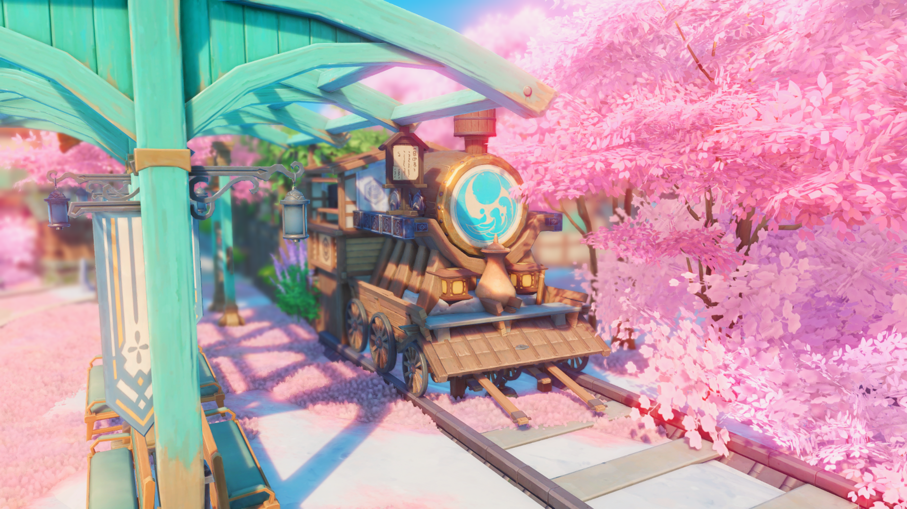

  <h1 class="header">HoYoShade</h1>
  <h3>
    登峰造极，终抵银河。
  </h3>

  

[EN](Readme.md)|**简体中文**|[繁體中文](Readme.Chinese_Traditional.md)  

<!-- 让孩子恰点饭吧，孩子想赚点钱玩Cosplay，还想去上海原神FES QAQ；感谢家人们。 -->  

> [!TIP]
> 嗨！你是miHoYo（米哈游）/ HoYoverse官方合约创作者吗？
> 
> 如果你在使用后认为HoYoShade对你的创作之路非常有帮助，你可以选择购买我们的**创作者计划（CREATOR PERMIUM）**，以此让你的HoYoShade在游戏内获得更加强大的功能，同时这也是我们获得收入的另一种渠道，也是你向HoYoShade贡献者表达支持的另一种方式。助你的创作之路更加顺利！
>
> 如需购买，**请使用中国大陆地区可用的联系方式（最好是QQ）：**[**联系我们**](#〢-联系我)
>
> 请注意：**创作者计划（CREATOR PERMIUM）** 所提供的HoYoShade均为闭源+加密代码，而非本仓库的开源源码。你不可以通过**创作者计划（CREATOR PERMIUM）** 所提供的HoYoShade进行源代码的二次开发/发行/分发。

> [!TIP]
> 需要在其它反作弊系统严格的游戏中可靠的注入ReShade？我们开发了更加抗封锁及抗检测的注入内核。截至目前，已获得部分其他游戏厂商官方合约创作者/博主的支持，且已经历时间的检验。你可以选择购买此注入内核的使用权以此实现你的目的，同时这也是我们获得收入的另一种渠道，也是你向HoYoShade贡献者表达支持的另一种方式。
>
> 如需购买，**请使用中国大陆地区可用的联系方式（最好是QQ）：**[**联系我们**](#〢-联系我)
>
> 请注意：**此项付费增值服务**所提供的ReShade均为闭源+加密代码，而非本仓库的开源源码。你不可以通过**此项付费增值服务**所提供的ReShade进行源代码的二次开发/发行/分发。

<!-- 让孩子恰点饭吧，孩子想赚点钱玩Cosplay，还想去上海原神FES QAQ；感谢家人们。 -->  

> [!NOTE]
> ·翻译并非100%准确，翻译工作主要基于OpenAI-GPT4o，谷歌翻译和本人的校对组成。 但即使如此，最终成品也难免会产生一定的问题。 如果你发现或者你认为这是一个问题，请提交issues以帮助HoYoShade改进。 
>  
> ·由于HoYoShade收到了DMCA警告，你无法再从Release界面下载低于V2.013.0 Stable版本的HoYoShade。有关详细情况，请查看[关于DMCA](#〢-关于DMCA)界面。   
> 
> ·对于Readme.md及HoYoShade在各平台的官方社群中所使用的所有来源于第三者的视频/图片展示均以获得创作者/有关第三者的授权。创作者/有关第三者均表示在创作过程中使用了HoYoShade，并知晓相关内容将会用于展示。

> [!IMPORTANT]
> · 截至目前，HoYoShade唯一的盈利手段只有以下手段：
> 
> - [**向开发者赞助**](#〢-赞助)
> - [**向开发者购买HoYoShade创作者计划（CREATOR PERMIUM）**](#〢-联系我)
> - [**向开发者购买友商游戏注入内核使用权**](#〢-联系我)
> 
> 如果你从第三者/店铺/平台购买了本Mod，请立即[**向我们报告**](#〢-联系我)，并立刻要求该第三者/店铺/平台进行退款。如有必要，请保留/固定相关证据，并向你所在地区的执法/司法单位进行报案。

## 〢 视频展示

  <h1 class="header">来自 白枝雪鸽|HoYo_Siraeda</h1>
  <h3>
    Just Another Day at the Section 6 | Fan-made short video | Zenless Zone Zero 绝区零同人实机短片 | 只是对空六课再平凡不过的一天...
  </h3>

https://github.com/user-attachments/assets/dc353d89-d479-43aa-b466-239a41e0173e

点击按钮：  

> [!NOTE]
> · 展示所使用的预设/效果库可能经过了用户自行添加/编辑。
>   
> · 本视频中使用的其他模组从未在中国大陆以外的地区发行，且 HoYoShade 不包含这些附加功能。  
> 
> · 展示所使用的预设/效果库/模组可能并未包含在HoYoShade Releases发行包中，如果你需要获取展示里所使用的预设/效果库/模组，你可能需要向该创作者获取相关内容。    
> 
> · 哔哩哔哩提供4K播放选项。如果你身处中国大陆，我们推荐你使用哔哩哔哩进行播放。  

## 〢 目录

- [〢 视频展示](#〢-视频展示)
- [〢 目录](#〢-目录)
- [〢 介绍](#〢-介绍)
- [〢 警告](#〢-警告)
- [〢 支持游戏列表](#〢-支持游戏列表)
- [〢 来源](#〢-来源)
- [〢 OpenHoYoShade和HoYoShade](#〢-openhoyoshade和hoyoshade)
- [〢 如何安装](#〢-如何安装)
- [〢 推荐游戏图像设置](#〢-推荐游戏图像设置)
- [〢 截图展示](#〢-截图展示)
- [〢 关于DMCA](#〢-关于dmca)
- [〢 鸣谢](#〢-鸣谢)
- [〢 赞助](#〢-赞助)
- [〢 联系我](#〢-联系我)
- [〢 贡献者](#〢-贡献者)

## 〢 介绍

HoYoShade是一个基于官方ReShade二次开发的开源版本。

相较于官方ReShade，HoYoShade：

- 为miHoYo（米哈游）/HoYoverse旗下的所有游戏及客户端添加了额外的支持，提供了可靠和可量化的统一注入方案，避免了用户因绕过反作弊系统/二改/不同配置下的分享的而付出额外的学习成本。
- 理论无视任何由miHoYo（米哈游）/HoYoverse官方对旗下所有游戏客户端发行的大版本更新/热更新。更新后可直接继续使用HoYoShade。
- 为大中华区内的国家及地区（中国大陆，香港，澳门，台湾，新加坡）乃至亚太地区/亚洲提供了优秀的本土化、独家功能及额外支持。
- 与众多miHoYo（米哈游）/HoYoverse官方合约创作者展开合作，创建了由众多miHoYo（米哈游）/HoYoverse官方合约创作者/原摄爱好者/玩家构成的社区。
- 针对miHoYo（米哈游）/HoYoverse旗下的所有游戏及客户端的热门模组，均针对性的进行了兼容/联动开发工作。
- 针对miHoYo（米哈游）/HoYoverse旗下的所有游戏及客户端制作了一些预设。（Presets）。
- 在某些国际网络受限的国家及地区提供了相较于官方ReShade更高的可靠性和可用性。
- 尽可能在文件结构和使用体验保持与官方ReShade一致，降低用户学习成本。

ReShade的工作原理是拦截CPU和GPU之间的通信，并修改渲染信息以达到提高图像质量的目的。

未来，HoYoShade将会支持更多的米哈游游戏。

HoYoShade集成了一些基于官方ReShade的开源项目并对其进行修改，具体列表请查看[来源页面](#〢-来源)。

有关本仓库贡献者的信息，请访问[贡献者界面](#〢-贡献者)

## 〢 警告

> [!Warning]
> ·受中国大陆地区当局政府的监管审查要求及政策因素，相较于国际服客户端，由miHoYo（米哈游）向中国大陆地区发行的专供客户端针对性加强了对于模组和外挂的识别及检测。所以，任何模组及外挂均有更大可能被米哈游识别，这也意味着你的账号更有可能会被封禁或导致其它严重后果。**没有任何模组和外挂可以保证你的游戏账号可以绝对安全**。HoYoShade虽然可以运行在官方服务器的miHoYo（米哈游）/HoYoverse游戏上，但并不保证你的游戏账号绝对安全。如果您担心您的游戏账号会被封禁，请考虑转而在相对监测力度较低的国际服客户端进行游玩（由HoYoverse发行），或考虑搭建私服进行游玩。  
> 
> ·在你将游戏内容发送至其它任何人或者进行直播之前，HoYoShade建议你先使用其它Mod隐藏游戏UID和用户信息，并且不要将HoYoShade及其它模组界面展示给其它任何人。

> [!NOTE]
> ·HoYoShade建议你将你的显卡和芯片组驱动更新至最新版本（如果可用），以获得来自你设备制造商的最新支持以尽可能减少与图形相关的问题，降低游戏崩溃的几率，并获得来自设备制造商的最新支持。  
> 
> ·我们不建议你在官方服务器上运行HoYoShade。  
> 
> ·我们不建议你使用Beta(测试服)客户端在官方服务器中运行HoYoShade，以免对HoYoShade全体开发者/全体二创开发者和你本人造成保密协议违约/违规/违法/经济损失等风险。  
> 
> ·对于可能会发生的任何后果，HoYoShade全体开发者/全体二创开发者均不会承担任何责任。  

## 〢 支持游戏列表
  
**公开(REL)客户端：**  
  
> [!NOTE]
> ·对于私服来说，如果私服所需的对应客户端出现在下方支持的游戏列表中，则说明HoYoShade可以提供支持。无需查看本地端是否支持ReShade/HoYoShade。  
> 
> ·我们不建议你在官方服务器上运行HoYoShade。  
> 
> ·对于并未出现在支持游戏列表中的游戏，你可以自行尝试选择使用注入器中已支持的游戏/在开发者选项中选择自定义注入来尝试注入HoYoShade。  
> 
> ·HoYoShade支持同时与其它主流/热门Mod一并注入，且不存在任何冲突问题。但请注意并确保其它游戏Mod之间不会有冲突（例：原神无人机与GIMI，3DMingo/GIMI和甜瓜）。  
>
> ·受某些国家及地区当局政府的监管审查要求及政策因素，在某些国家和地区中（例如：越南），你所获得的国际服客户端可能并非由miHoYo（米哈游）/HoYoverse发行，而是HoYoverse与当地游戏发行商联合发行/由当地游戏发行商发行。此类客户端除发行信息外，与正常由HoYoverse发行的国际服客户端基本无异，并不会影响HoYoShade的注入支持。
> 
> ·原神无人机在每次原神游戏版本更新后均需要等待适配，而HoYoShade理论无视游戏版本更新。此问题与HoYoShade无关。
  
| 客户端 | 是否已测试 | 是否支持 | 是否存在游戏版本限制 |
| --- | --- | --- | --- |
| **原神(中国大陆服/天空岛)** | 是 | 是 | 无游戏版本限制 |
| **原神(哔哩哔哩服/世界树)** | 是 | 是 | 无游戏版本限制 |
| **原神(国际服)** | 是 | 是 | 无游戏版本限制 |
| **原神(Epic游戏商店版本)** | 是 | 是 | 无游戏版本限制 |
| **崩坏3(中国大陆服)** | 是 | 是 | 无游戏版本限制 |
| **崩坏3(中国大陆Steam服)** | 是 | 是 | 无游戏版本限制 |
| **崩坏3(繁中服)** | 是 | 是 | 无游戏版本限制 |
| **崩坏3(韩国服)** | 是 | 是 | 无游戏版本限制 |
| **崩坏3(日本Steam服)** | 是 | 是 | 无游戏版本限制 |
| **崩坏3(东南亚服)** | 是 | 是 | 无游戏版本限制 |
| **崩坏3(欧美服)** | 是 | 是 | 无游戏版本限制 |
| **崩坏:星穹铁道(中国大陆服)** | 是 | 是 | 无游戏版本限制 |
| **崩坏:星穹铁道(哔哩哔哩服)** | 是 | 是 | 无游戏版本限制 |
| **崩坏:星穹铁道(国际服)** | 是 | 是 | 无游戏版本限制 |
| **崩坏:星穹铁道(Epic版本)** | 是 | 是 | 无游戏版本限制 |
| **绝区零(中国大陆服/国际服客户端)** | 是 | 是 | 无游戏版本限制 |
  
**内测(CB/CBT/Beta)客户端:**    
  
> [!NOTE]
> ·对于私服来说，如果私服所需的对应客户端出现在下方支持的游戏列表中，则说明HoYoShade可以提供支持。无需查看本地端是否支持ReShade/HoYoShade。  
>
> 通常来说，除版本号外，创作者体验服(Creator Experience/CE/KOL)客户端通常和同一版本时期下最后一个版本的Beta(测试服)/客户端无异。
> 
> ·miHoYo（米哈游）/HoYoverse在公测后面向测试者的Beta(测试服)/创作者体验服客户端通常客户端版本号为:X.5.X，X.X.Y(此处的X为现行REL(公测/公开)版本号)，X.X.Y0(此处的X为现行REL(公测/公开)版本号)等/通常会在文件加密/启动器中有别于REL(公测/公开)客户端/在版本号前缀有别于与REL(公测/公开)客户端，请自行甄别你所持有的客户端的版本及来源。  
> 
> ·HoYoShade理论上也可以对Beta(测试服)/创作者体验服客户端提供注入和运行支持，但我们对任何测试服客户端的注入和运行支持不作成功性/功能性保证。  
> 
> ·我们不建议你使用Beta(测试服)/创作者体验服客户端在官方服务器中运行HoYoShade，以免对HoYoShade全体开发者/二创开发者和阁下本人造成保密协议违约/违规/违法/经济损失等风险。   
> 
> ·除非下列表格中的选项为"是"，否则这说明HoYoShade仅对该类型下被泄露出来的部分客户端进行了测试并得出了支持的结论。这不代表所有版本/类型/来源的不同游戏的内测客户端均可运行HoYoShade，请自行测试。  
> 
> ·如果你正在使用的Beta(测试服)/创作者体验服客户端并不支持运行HoYoShade，并且你非常确定这并非是使用了错误的注入选项导致的问题，请在[issues界面](https://github.com/DuolaD/HoYoShade/issues)新建issues以帮助我们适配。或者使用启动器的开发者功能尝试自定义注入。  
> 
> ·对于并未出现在支持游戏列表中的游戏，你可以自行尝试选择使用注入器中已支持的游戏/在开发者选项中选择自定义注入来尝试注入HoYoShade。    
> 
> ·原神无人机不可用于任何测试服客户端。此问题与HoYoShade无关。  
  
| 客户端 | 是否已测试 | 是否支持 | 是否存在游戏版本限制 |
| --- | --- | --- | --- |
| **原神(海外 部分公测前内测客户端)** | 已在部分被泄露的客户端测试 | 已在部分被泄露的客户端中测试并支持* | - |
| **原神(中国大陆 全部公测前内测客户端)** | 已在部分被泄露的客户端测试 | 已在部分被泄露的客户端中测试并支持* | - |
| **原神(中国大陆/海外 公测后内测客户端)** | 已在部分被泄露的客户端测试 | 已在部分被泄露的客户端中测试并支持* | - |
| **崩坏3(中国大陆/海外 公测后内测客户端)** | 已在部分被泄露的客户端测试 | 已在部分被泄露的客户端中测试并支持* | - |
| **崩坏:星穹铁道(中国大陆/海外 公测前内测客户端)** | 已在部分被泄露的客户端测试 | 已在部分被泄露的客户端中测试并支持* | - |
| **崩坏:星穹铁道(中国大陆/海外 公测后内测客户端)** | 已在部分被泄露的客户端测试 | 已在部分被泄露的客户端中测试并支持* | - |
| **绝区零(中国大陆/海外 第一次/公测前内测)(0.10)** | 是 | 是* | 无游戏版本限制 |
| **绝区零(中国大陆/海外 第二次公测前内测)(0.20)** | 是 | 是* | 无游戏版本限制 |
| **绝区零(中国大陆独占 第三次公测前内测)(0.3X)** | 是 | 是* | 无游戏版本限制 |
| **绝区零(中国大陆/海外 第四次公测前内测)(0.3X)** | 是 | 是* | 无游戏版本限制 |
| **绝区零(中国大陆/海外 公测后内测客户端)(X.X.X/X.X.X0)** | 已在部分被泄露的客户端测试 | 已在部分被泄露的客户端中测试并支持* | - |
| **崩坏：因缘精灵(中国大陆/海外 CB1 内测客户端)** | 是 | 是* | 无游戏版本限制 |

*:可能需要向开发者获取额外补丁方可注入。

**创作者体验服(Creator Experience/CE/KOL)客户端:**    
  
> [!NOTE]
> ·对于私服来说，如果私服所需的对应客户端出现在下方支持的游戏列表中，则说明HoYoShade可以提供支持。无需查看本地端是否支持ReShade/HoYoShade。  
>
> 通常来说，除版本号外，创作者体验服(Creator Experience/CE/KOL)客户端通常和同一版本时期下最后一个版本的Beta(测试服)/客户端无异。
>
> ·miHoYo（米哈游）/HoYoverse在公测后面向测试者的Beta(测试服)/创作者体验服客户端通常客户端版本号为:X.5.X，X.X.Y(此处的X为现行REL(公测/公开)版本号)，X.X.Y0(此处的X为现行REL(公测/公开)版本号)等/通常会在文件加密/启动器中有别于REL(公测/公开)客户端/在版本号前缀有别于与REL(公测/公开)客户端，请自行甄别你所持有的客户端的版本及来源。  
> 
> ·HoYoShade理论上也可以对Beta(测试服)/创作者体验服客户端提供注入和运行支持，但我们对任何测试服客户端的注入和运行支持不作成功性/功能性保证。  
> 
> ·我们不建议你使用Beta(测试服)/创作者体验服客户端在官方服务器中运行HoYoShade，以免对HoYoShade全体开发者/二创开发者和阁下本人造成保密协议违约/违规/违法/经济损失等风险。  
> 
> ·除非下列表格中的选项为"是"，否则这说明HoYoShade仅对该类型下被泄露出来的部分客户端进行了测试并得出了支持的结论。这不代表所有版本/类型/来源的不同游戏的内测客户端均可运行HoYoShade，请自行测试。  
> 
> ·如果你正在使用的Beta(测试服)/创作者体验服客户端并不支持运行HoYoShade，并且你非常确定这并非是使用了错误的注入选项导致的问题，请在[issues界面](https://github.com/DuolaD/HoYoShade/issues)新建issues以帮助我们适配。或者使用启动器的开发者功能尝试自定义注入。  
> 
> ·对于并未出现在支持游戏列表中的游戏，你可以自行尝试选择使用注入器中已支持的游戏/在开发者选项中选择自定义注入来尝试注入HoYoShade。    
> 
> ·原神无人机不可用于任何创作者体验服客户端。此问题与HoYoShade无关。  
  
| 客户端 | 是否已测试 | 是否支持 | 是否存在游戏版本限制 |
| --- | --- | --- | --- |
| **原神(中国大陆/海外 创作者体验服客户端)** | 已在部分被泄露的客户端测试 | 已在部分被泄露的客户端中测试并支持* | - |
| **崩坏:星穹铁道(中国大陆/海外 创作者体验服客户端)** | 已在部分被泄露的客户端测试 | 已在部分被泄露的客户端中测试并支持* | - |
| **绝区零(中国大陆/海外 创作者体验服客户端)** | 已在部分被泄露的客户端测试 | 已在部分被泄露的客户端中测试并支持* | - |

*:可能需要向开发者获取额外补丁方可注入。

<!-- 问题不大，如果不支持的话我应该也会第一时间知道消息的 XD。 -->  
<!-- 针对DevKit客户端的支持...就没啥写的必要了吧...... -->  

## 〢 来源

**当前正在使用的资源：**

| 名字 | 介绍 | 网址 |
| --- | --- | --- |
| **ReShade官方** | HoYoShade会保证最新发行版中的ReShade总是和ReShade最新版本保持一致 | [官方仓库](https://github.com/crosire/reshade) \ [官方网站](https://reshade.me) |
| **来自Crosire的ReShade注入器（经过修改）** | 一个支持 ReShade 注入到 miHoYo（米哈游）/HoYoverse 游戏客户端的注入器。并进行修改以使其更易于使用。 | [官方仓库](https://github.com/crosire/reshade) \ [前往ReShade官方仓库查看源码](https://github.com/crosire/reshade/blob/main/tools/injector.cpp) \ [前往HoYoShade仓库查看经过我们修改后的源码](https://github.com/DuolaD/HoYoShade/blob/V2.X.X-Stable/inject_mod.cpp) |
| **MiSans系列字体** | HoYoShade默认字体，版权归小米集团所有。  | [官方网站](https://www.mi.com) \ [MiSans系列字体官方网站](https://hyperos.mi.com/font/) |
| **miHoYo（米哈游）/ HoYoverse旗下游戏客户端字体** | HoYoShade内置可选字体，从游戏客户端中提取。版权归miHoYo（米哈游）/ HoYoverse所有。  | [miHoYo官方网站](https://www.mihoyo.com) \ [HoYoverse官方网站](https://www.hoyoverse.com) |

**已过时的资源：**

| 名字 | 介绍 | 网址 |
| --- | --- | --- |
| **微软雅黑** | HoYoShade V2.5.1 Stable以及更早版本的默认字体，版权归微软集团所有。由于潜在的版权风险问题，现已弃用。(仅用于V2.5.1 Stable和更早版本) | [官方网站](https://www.microsoft.com) |
| **Aria2** | 用于非强制版本检测器下载版本信息和最新Mod包。由于版本信息同步问题，现已弃用。(仅用于V2.0131.0 Stable至V2.11.3 Stable中) | [官方仓库](https://github.com/aria2/aria2) \ [官方网站](https://aria2.github.io/) |

## 〢 OpenHoYoShade和HoYoShade

我们自发行V2.012.2 Stable版本开始，会随着HoYoShade版本更新一并发布OpenHoYoShade。  

相较于HoYoShade：

- OpenHoYoShade为HoYoShade底层基本框架，它涵盖了使ReShade注入至miHoYo（米哈游）/HoYoverse旗下的所有游戏及客户端的所有必要文件。  
- OpenHoYoShade存储占用会比HoYoShade小, 但OpenHoYoShade并没有内置ReShade效果库，预设等，适用于想对HoYoShade进行二次开发的二次开发者。  

如果你只是想在miHoYo（米哈游）/HoYoverse游戏下使用ReShade，请下载HoYoShade。    

如果你想要开发一个可以在miHoYo（米哈游）/HoYoverse游戏下使用的ReShade，但是你又不想学习过多的东西，那么你可以选择下载OpenHoYoShade。  

要使 OpenHoYoShade 快速工作，您唯一需要做的就是将效果库和预设放在各自正确的位置。  
但如果你愿意，你可以进行进一步的开发，比如注入器、Reshade.ini构建器等，甚至重新发行！（开源万岁！)  

**在你重新发行文件时，确保你重新发行的文件遵守了BSD-3开源协议**

当然了,如果你想要获得旧版注入程序/更多信息，请查看Commit历史记录，或拉取本仓库。

如果你还是不明白OpenHoYoShade和HoYoShade之间有什么不同，  
那么以下的图表也许可以很好的帮助你说明：

|  | OpenHoYoShade | HoYoShade |
| --- | --- | --- |
| **ReShade** | 有 | 有 |
| **使ReShade注入至全系米哈游旗下游戏的所有必要文件** | 有 | 有 |
| **程序源代码** | 有 | 没有（但源代码将与HoYoShade仓库及OpenHoYoShade内的源代码文件保持一致） |
| **Reshade的效果库(包括插件)** | 没有(你需要自行准备) | 没有(你需要自行准备) |
| **预设** | 没有(你需要自行准备) | 有 |
| **谁会需要他们？** | 二次开发者 | 普通游戏玩家 |

## 〢 如何安装

从[本仓库的发行页面](https://github.com/DuolaD/HoYoShade/releases/latest)下载最新版本的(Open)HoYoShade.  
解压后按照zip压缩包内的教程操作即可  

  对文字版教程感到困惑吗？点击按钮在或者在观看视频版教程*。  

 

*：仅提供简体中文/繁体中文版本。

## 〢 推荐游戏图像设置

> [!NOTE]
> ·这里推荐的图像设置是基于《原神》作为参考的。您可以使用这些推荐的图形设置来修改其他米哈游游戏的图像设置，或者您也可以选择自定义图像设置。  
> ·如果您的显卡性能低于NVIDIA GTX系列水平，则不建议您使用HoYoShade和FPS解锁。

| 设置 | 比NVIDIA GTX系列性能低的显卡 | 英伟达GTX系列或其他同等级别的显卡 | 英伟达RTX系列或其他同等级别的显卡 |
| --------------------------- | --------------------------------- |------------------------------------ |:------------------------------------ |
| **分辨率** | 1920x1080 (或更高) | 1920x1080 (或更高) | 1920x1080 (或更高) |
| **亮度** | 默认值（您可以选择将亮度减少两到三个点） | 默认值（您可以选择将亮度减少两到三个点） | 默认值（您可以选择将亮度减少两到三个点）| 默认值（您可以选择将亮度减少两到三个点）|
| **帧率** | 60 | 60 | 60 (使用FPS解锁器或其它类似的模组可以获得更高的帧率) |
| **垂直同步** | 关闭（如果画面有撕裂感，请启用此选项） | 关闭（如果画面有撕裂感，请启用此选项） | 关闭（如果画面有撕裂感，请启用此选项）|
| **渲染精度** | 0.6~1.0 | 0.6~1.1 | 1.5 (如果您的游戏帧率在设置为1.5后无法稳定在60，请将其设置为1.1或1.0) |
| **阴影质量** | 极低 或 低 | 中 | 高 |
| **后期效果** | 极低 或 低 | 中 | 高 |
| **特效质量** | 极低 或 低 | 中 | 高 |
| **场景细节** | 极低 或 低 | 中 或 高 | 高 或 极高 |
| **抗锯齿** | 关闭 or FSR 2 | FSR 2 | SMAA/FXAA (如果您的帧率在选择SMAA/FXAA后偏低，请使用 FSR 2) |
| **体积雾** | 关闭 | 开启(你可以选择关闭) | 开启 |
| **反射** | 关闭 | 开启(你可以选择关闭) | 开启 |
| **动态模糊** | 关闭 或 低 | 低 或 高 | 高 或 非常高 |
| **Bloom** | 开启(你可以选择关闭) | 开启(你可以选择关闭) | 开启(你可以选择关闭) |
| **人群密度** | 低 | 低 或 高 | 高 |
| **多人游戏队友特效** | 完全屏蔽 | 打开 | 打开 |
| **次表面散射** | 关闭 | 中 或 高 | 高 |
| **各向异性采样** | 16x | 16x | 16x |

> [!Warning]
> 请注意，在一般情况下，大多数的FPS解锁器都会要求你不要在使用FPS解锁器的情况下更改游戏中的帧率设置。

## 〢 截图展示

  <h1 class="header">由HoYoShade用户拍摄</h1>

  
  
  
  
  
  
  
  
  
  
  
  
  
  
  
  
  
  
  

感谢以下所有创作者对本项目的展示界面所做出的贡献！   

    <table>
    <tr>
	<td>
  	<h3>白枝雪鸽|HoYo_Siraeda</h3>
		<a href="https://space.bilibili.com/375807068">
		
		<h6>创作内容：</h6>
		<a href="https://www.youtube.com/watch?v=zZKg6ep4Kvg">Just Another Day at the Section 6 | Fan-made short video | Zenless Zone Zero 绝区零同人实机短片 | 只是对空六课再平凡不过的一天...</a> 
		</a>
    </td>
    <td>
        <a href="https://www.youtube.com/@HoYo_Siraeda">YouTube频道</a> 
        <a href="https://v.douyin.com/_0oRPA6kJ2A">抖音频道</a> 
        <a href="https://space.bilibili.com/375807068">哔哩哔哩频道</a>
	  </td>
    </tr>
    <tr>
	<td>
		<h3>WatchAndyTW</h3>
		<a href="https://github.com/WatchAndyTW">
		
		<h6>创作内容：</h6>
		<a href="Readme.md-image/ScreenShot1.png">截图展示1</a> 
		</a>
	    </td>
	<td>
		<a href="https://github.com/WatchAndyTW">WatchAndyTW的GitHub主页</a> 
	</td>
	</tr>
	<tr>
	<td>
		<h3>摄影：枝枝</h3>
		<h3>尘歌壶场景来源：衣贤珊、H小距离、风-笑尘、云端遇梦深、花镜</h3>
		
		
		
		
		
		<h6>创作内容：</h6>
		<a href="Readme.md-image/ScreenShot4.jpg">截图展示4</a> 
		<a href="Readme.md-image/ScreenShot5.jpg">截图展示5</a> 
		<a href="Readme.md-image/ScreenShot6.png">截图展示6</a> 
		<a href="Readme.md-image/ScreenShot7.jpg">截图展示7</a> 
		<a href="Readme.md-image/ScreenShot8.jpg">截图展示8</a> 
		<a href="Readme.md-image/ScreenShot9.png">截图展示9</a> 
		<a href="Readme.md-image/ScreenShot10.jpg">截图展示10</a> 
		<a href="Readme.md-image/ScreenShot11.jpg">截图展示11</a> 
		<a href="Readme.md-image/ScreenShot12.jpg">截图展示12</a> 
		<a href="Readme.md-image/ScreenShot13.jpg">截图展示13</a> 
		<a href="Readme.md-image/ScreenShot14.jpg">截图展示14</a> 
		<a href="Readme.md-image/ScreenShot15.jpg">截图展示15</a> 
		<a href="Readme.md-image/ScreenShot16.jpg">截图展示16</a> 
		<a href="Readme.md-image/ScreenShot17.jpg">截图展示17</a> 
		<a href="Readme.md-image/ScreenShot18.jpg">截图展示18</a> 
		<a href="Readme.md-image/ScreenShot19.jpg">截图展示19</a> 
		</a>
	    </td>
	<td>
		<a href="https://user.qzone.qq.com/29153360">枝枝的QQ空间主页</a> 
		<a href="https://space.bilibili.com/510178318">衣贤珊的哔哩哔哩频道</a> 
		<a href="https://space.bilibili.com/23559567">H小距离的哔哩哔哩频道</a> 
		<a href="https://space.bilibili.com/1803227895">风-笑尘的哔哩哔哩频道</a> 
	</td>
	</tr>
         
         
        </td>
    </table>

 

> [!NOTE]
> · 出于部分创作者的要求/MCN中间机构规定/miHoYo（米哈游）或HoYoverse合约创作者规定，除非得到明确答复，否则此名单中将仅展示同意进行展示的创作者。部分使用HoYoShade进行创作/展示的创作者将不会出现在此列表中。  
> 
> · 展示所使用的预设/效果库可能经过了用户自行添加/编辑。
>   
> · 展示中所使用的其他模组可能并非来自 HoYoShade，且 HoYoShade 不包含这些附加功能。   
> 
> · 展示所使用的预设/效果库可能并未包含在HoYoShade Releases发行包中，如果你需要获取展示里所使用的预设/效果库/模组，你可能需要向该创作者获取相关内容。  

## 〢 关于DMCA
由于HoYoShade收到了DMCA警告，你无法再从Release界面下载低于V2.013.0 Stable版本的HoYoShade。  

不受到影响的内容有：  
V1.0.0 Stable  
OpenHoYoShade[All]  
2.012.1_2.012.2_hdiff.zip  

## 〢 鸣谢
感谢以下合作伙伴的支持：  
| 名字 | 介绍 | 网址 |
| --- | --- | --- |
| **CY Team** | HoYoShade合作伙伴/微软企业存储计划提供 | [官方网站](https://www.cyteam.cn/) |
| **Cloudflare, Inc.** | 域名托管和管理 | [官方网站](https://www.cloudflare.com/) |

## 〢 赞助

 **点击对应按钮来赞助HoYoShade**  
赞助的金额由你自行设定。

[**点击前往我的GitHub个人首页Readme.md向我提供赞助**](https://github.com/DuolaD/DuolaD/blob/main/Readme.Chinese_Simplified.md)

## 〢 联系我

> [!NOTE]
> ·如果你处于中国大陆地区，则某些联系方式可能不可用。结尾带星号标识'*'的联系方式可以保证在中国大陆地区使用，并且可以获得更快速的响应和支持。  
> 
> ·如果你在使用此模组时有任何的问题，我们建议先在本仓库创建一个issue。

[**点击前往我的GitHub个人首页Readme.md联系我**](https://github.com/DuolaD/DuolaD/blob/main/Readme.Chinese_Simplified.md)

## 〢 贡献者
我们真诚的感谢以下所有出色的贡献者，以及与我们进行合作的miHoYo（米哈游）/HoYoverse官方合约创作者，各赞助商/赞助者，还有各位使用HoYoShade的你们。HoYoShade因你们而精彩！

感谢所有贡献者对本项目的无私贡献！

    <table>
        <tr>
            <td>
                <h3>DuolaDStudio Hong Kong Ltd.</h3>
                
		<h3>也就是以下成员：</h3>
		<h5>哆啦D夢|DuolaD & 琳尼特|LynetteNotFound</h5>
		<a href="https://github.com/DuolaD"></img></a>
		
            </td>
	    <td>
                <a href="https://github.com/DuolaDStudio">组织的GitHub主页</a> 
		<a href="https://github.com/DuolaD">哆啦D夢|DuolaD的GitHub个人主页</a> 
		<a href="https://github.com/LynetteNotFound">琳尼特|LynetteNotFound的GitHub个人主页</a> 
		 
		<a>注意:哆啦D夢|DuolaD其它个人主页链接见上;</a> 
		<a>琳尼特|LynetteNotFound没有公开联系方式</a>
            </td>
	</tr>
        <tr>
            <td>
                <h3>渊麒|ZelbertYQ</h3>
                
            </td>
            <td>
    <a href="https://github.com/ZelbertYQ">GitHub个人主页</a> 
		<a href="https://space.bilibili.com/435289515">哔哩哔哩频道</a>
    <a href="https://v.douyin.com/gah7b4ZwQqo">抖音频道</a>
    <a href="https://www.xiaohongshu.com/user/profile/660ad54b000000001701a61c">小红书频道</a>
            </td>
        </tr>
        <tr>
            <td>
                <h3>REL(Ex_M)</h3>
                
            </td>
            <td>
                <a href="https://github.com/34736384">GitHub个人主页</a> 
		<a href="https://space.bilibili.com/44434084?spm_id_from=333.337.0.0">BiliBili频道</a>
            </td>
        </tr>
    </table>

