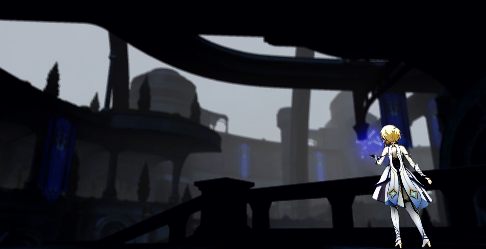

  <h1 class="header">HoYoShade</h1>
  <h3>
    登峯造極，終抵銀河。
  </h3>

  

[EN](Readme.md)|[简体中文](Readme.Chinese_Simplified.md)|**繁體中文**  

> [!NOTE]
> ·我們深知您可能熟悉第二語言。但如果你來自於中國大陸地區,我們更加推薦你去閱讀[簡體中文版本的Readme.md](Readme.Chinese_Simplified.md)以獲得更多有關僅在中國大陸發布的另一款原神模組的資訊。  
> ·翻譯並非100%準確，翻譯工作主要基於OpenAI-GPT4o，谷歌翻譯和本人的校對組成。 但即使如此，最終成品也難免會產生一定的問題。 如果你發現或者你認爲這是一個問題，請提交issues以幫助HoYoShade改進。  
> ·正在尋找舊版本嗎？我們正在開發 [HoYoShade-RePublish](https://github.com/DuolaD/HoYoShade-RePublish) 倉庫。完成後，您可以下載所有舊版本的Release，聽起來不錯？當然，重新發行的內容肯定會移除全部受到DMCA警告的內容的。  
> ·由於HoYoShade收到了DMCA警告，你無法再從Release界面下載低於V2.013.0 Stable版本的HoYoShade。有關詳細情況，請查看[關於DMCA](#〢-關於DMCA)界面。  

## 〢 視頻演示

  <h1 class="header">Shot by AXBro阿向菌</h1>
  <h3>
    Night,Diluc 雨夜，迪盧克實拍短片
  </h3>
  點擊下方圖片在觀看:

或者點擊此按鈕：

> [!NOTE]
> · 截圖展示所使用的預設/效果庫可能經過了用戶自行添加/編輯。  
> · 本視頻中使用的其他模組未在中國大陸以外的地區發行，且 HoYoShade 不包含這些附加功能。  
> · 嗶哩嗶哩提供4K播放選項，如果你身處中國大陸，我們推薦你使用嗶哩嗶哩進行播放。  

## 〢 目錄

- [**介紹**](#〢-介紹)
- [**警告**](#〢-警告)
- [**支持游戲列表**](#〢-支持游戲列表)
- [**來源**](#〢-來源)
- [**OpenHoYoShade和HoYoShade**](#〢-OpenHoYoShade和HoYoShade)
- [**如何安裝?**](#〢-如何安裝)
- [**推薦遊戲畫面設置**](#〢-推薦遊戲畫面設置)
- [**截圖展示**](#〢-截圖展示)
- [**關於DMCA**](#〢-關於DMCA)
- [**鳴謝**](#〢-鳴謝)
- [**贊助**](#〢-贊助)
- [**聯繫我**](#〢-聯繫我)
- [**貢獻者**](#〢-貢獻者)

## 〢 介紹

這是一個非官方Reshade，使其能在突破米哈遊對於官方Reshade的封鎖下正常用於所有可在PC端運行的米哈遊遊戲。

ReShade的工作原理是攔截CPU和GPU之間的通信，並修改渲染信息以達到提高圖像質量的目的。HoYoShade集成了一些基於官方ReShade的開源項目(具體列表請查看[來源頁面](#〢-來源))並對其進行修改，使其與PC上所有的米哈遊遊戲兼容，並製作一些有針對性的預設。未來，它將支持更多的米哈遊遊戲。

有關本倉庫貢獻者的信息，請訪問[貢獻者界面](#〢-貢獻者)

## 〢 警告

> [!Warning]
> ·中國大陸服原神由於對接了騰訊的反作弊系統，並且針對性加強了對於模組識別。所以任何模組及外掛均有更大可能被米哈遊識別，這也意味着你的賬號更有可能會被封禁或導致其它嚴重後果。沒有任何模組和外掛可以保證你的遊戲賬號可以絕對安全。HoYoShade雖然可以運行在官方服務器的米哈遊遊戲上，但並不保證你的你的遊戲賬號絕對安全。如果您擔心您的遊戲帳號會被封鎖，請考慮搭建私服。  
> ·在你將遊戲內容發送至其它任何人或者進行直播之前，HoYoShade建議你先使用其它Mod隱藏遊戲UID和用戶信息，並且不要將HoYoShade及其它模組界面展示給其它任何人。

> [!NOTE]
> ·HoYoShade建議你將你的顯示卡和晶片組驅動更新至最新版本（如果可用），以獲得來自你設備製造商的最新支持以盡可能減少與圖形相關的問題，降低遊戲崩潰的幾率，並獲得來自設備製造商的最新支援。  
> ·我們不建議你在官方伺服器上運行HoYoShade。  
> ·我們不建議你使用Beta客戶端在官方伺服器中運行HoYoShade，以免對HoYoShade全體開發者/全體二創開發者和你本人造成保密協議違約/違規/違法/經濟損失等風險。  
> ·對於可能發生的任何後果，HoYoShade全體開發者/全體二創開發者均不會承擔任何責任。  

## 〢 支持游戲列表

> [!NOTE]
> ·對於私服玩家來說，如果私服所需的對應客戶端出現在下方支援的遊戲清單中，則表示HoYoShade可以提供支援。  
> ·對於MiHoYo/HoYoVerse開發商在公測後面向測試者的Beta版客戶端(通常客戶端版本號為:現行版本號.5.X)，HoYoShade理論上也可以提供注入和運行支援。但我們不建議你使用Beta客戶端在官方伺服器中運行HoYoShade，以免對HoYoShade全體開發者/二創開發者和你本人造成保密協議違約/違規/違法/經濟損失等風險。  
> ·對於未出現在支援遊戲清單中的遊戲，你可以自行嘗試選擇使用注入器中已支援的遊戲/在開發者選項中選擇自訂注入來嘗試注入HoYoShade。  
> ·HoYoShade支持同時於其它主流Mod一併注入，且不存在任何衝突問題。但請注意並確保其它遊戲Mod之間不會有衝突。  

| 客戶端 | 是否已測試 | 是否支持 | 是否存在游戲版本限制 |
| --- | --- | --- | --- |
| **原神/YuanShen/Genshin Impact(中國大陸服/天空島)** | 是 | 是 | 無遊戲版本限制 |
| **原神/YuanShen/Genshin Impact(嗶哩嗶哩服/世界樹)** | 是 | 是 | 無遊戲版本限制 |
| **原神/YuanShen/Genshin Impact(國際服)** | 是 | 是 | 無遊戲版本限制 |
| **原神/YuanShen/Genshin Impact(Epic版本)** | 是 | 是 | 無遊戲版本限制 |
| **崩壞3/BH3/Honkai Impact 3rd(中國大陸服)** | 是 | 是 | 無遊戲版本限制 |
| **崩壞3/BH3/Honkai Impact 3rd(中國大陸Steam服)** | 是 | 是 | 無遊戲版本限制 |
| **崩壞3/BH3/Honkai Impact 3rd(繁中服)** | 是 | 是 | 無遊戲版本限制 |
| **崩壞3/BH3/Honkai Impact 3rd(韓國服)** | 是 | 是 | 無遊戲版本限制 |
| **崩壞3/BH3/Honkai Impact 3rd(日本Steam服)** | 是 | 是 | 無遊戲版本限制 |
| **崩壞3/BH3/Honkai Impact 3rd(東南亞服)** | 是 | 是 | 無遊戲版本限制 |
| **崩壞3/BH3/Honkai Impact 3rd(歐美服)** | 是 | 是 | 無遊戲版本限制 |
| **崩壞:星穹鐵道/Honkai: Star Rail(中國大陸服)** | 是 | 是 | 無遊戲版本限制 |
| **崩壞:星穹鐵道/Honkai: Star Rail(嗶哩嗶哩服)** | 是 | 是 | 無遊戲版本限制 |
| **崩壞:星穹鐵道/Honkai: Star Rail(國際服)** | 是 | 是 | 無遊戲版本限制 |
| **崩壞:星穹鐵道/Honkai: Star Rail(Epic版本)** | 是 | 是 | 無遊戲版本限制 |
| **絕區零/ZZZ/Zenless Zone Zero(中國大陸/海外 第一次公測前內測)(0.10)** | 是 | 是 | 無遊戲版本限制 |
| **絕區零/ZZZ/Zenless Zone Zero(中國大陸/海外 第二次公測前內測)(0.20)** | 是 | 是 | 無遊戲版本限制 |
| **絕區零/ZZZ/Zenless Zone Zero(中國大陸獨佔 第三次公測前內測)(0.3X)** | 是 | 是 | 無遊戲版本限制 |
| **絕區零/ZZZ/Zenless Zone Zero(中國大陸/海外 第四次公測前內測)(0.3X)** | 是 | 是 | 無遊戲版本限制 |
| **絕區零/ZZZ/Zenless Zone Zero 中國大陸 1.0 公測客戶端** | 是 | 是 | - |
| **絕區零/ZZZ/Zenless Zone Zero 海外 1.0 公測客戶端** | 是 | 是 | - |

## 〢 來源

| 名字 | 介紹 | 網址 |
| --- | --- | --- |
| **ReShade官方** | HoYoShade會保證最新發行版中的ReShade總是和ReShade最新版本保持一致 | [官方倉庫](https://github.com/crosire/reshade),[官方網站](https://reshade.me/) |
| **Crosire的ReShade注入器** | 這只是一個注入器 | [前往ReShade官方倉庫查看源碼](https://github.com/crosire/reshade/blob/main/tools/injector.cpp) |
| **Aria2** | 用於非強製版本檢測器下載版本信息和最新Mod包(僅用於V2.0131.0 Stable至V2.11.3 Stable中) | [官方倉庫](https://github.com/aria2/aria2),[官方網站](https://aria2.github.io/) |

## 〢 OpenHoYoShade和HoYoShade

我們自發行V2.012.2 Stable版本開始，會隨著HoYoShade版本更新一併發布OpenHoYoShade。  

OpenHoYoShade為HoYoShade底層基本框架，它涵蓋了使ReShade注入至全系米哈遊旗下遊戲的所有必要文件。  
OpenHoYoShade儲存佔用會比HoYoShade小,但OpenHoYoShade並沒有內建ReShade效果庫，預設等，適用於想對HoYoShade進行二次開發的二次開發者。  

如果你只是想在MiHoYo/HoYoVerse遊戲下使用ReShade，請下載HoYoShade。  
如果你想要開發一個可以在MiHoYo/HoYoVerse遊戲下使用的ReShade，但是你又不想學習過多的東西，那麼你可以選擇下載OpenHoYoShade。  

要讓 OpenHoYoShade 快速運作，您唯一需要做的就是將效果庫和預設放在各自正確的位置。  
但如果你願意，你可以進行進一步的開發，例如注入器、Reshade.ini建構器等等等等，甚至重新發行！ （開源萬歲！)  
(哦對了......當你重新發行文件時，確保你重新發行的文件遵守了BSD-3開源協議)  

當然了,如果你想要獲得舊版註入程序/更多信息，請在GitHub倉庫中點擊‘Code’按鈕，然後選擇‘Download Zip’。  

如果你還是不明白OpenHoYoShade和HoYoShade之間有什麼不同，那麼以下的圖表或許可以很好的幫助你說明：  

|  | OpenHoYoShade | HoYoShade |
| --- | --- | --- |
| **ReShade** | 有 | 有 |
| **使ReShade注入至全系米哈遊旗下遊戲的所有必要文件** | 有 | 有 |
| **程式原始碼** | 有 | 没有 |
| **Reshade的效果庫(包含插件)** | 沒有(你需要自行準備) | 有 |
| **預設** | 沒有(你需要自行準備) | 有 |
| **誰會需要他們？** | 二次開發者 | 普通遊戲玩家 |

## 〢 如何安裝

舊版本:
從[本倉庫的發行頁面](https://github.com/DuolaD/HoYoShade/releases/)下載最新的zip包並解壓。  
然後按照zip壓縮包內的教程操作即可  

New:(等待GUI開發完成)

## 〢 推薦遊戲畫面設置

> [!NOTE]
> ·這裏推薦的畫面設置是基於《原神》作爲參考的。您可以使用這些推薦的畫面設置來修改其他米哈遊遊戲的畫面設置，或者您也可以選擇自定義畫面設置。  
> ·如果您的顯卡性能低於NVIDIA GTX系列水平，則不建議您使用HoYoShade和FPS解鎖。

| 設置 | 比NVIDIA GTX系列性能低的顯卡 | 英偉達GTX系列或其他同等級別的顯卡 | 英偉達RTX系列或其他同等級別的顯卡 |
| --------------------------- | --------------------------------- |------------------------------------ |:------------------------------------ |
| **顯示模式** | 1920x1080 (或更高) | 1920x1080 (或更高) | 1920x1080 (或更高) |
| **亮度** | 默認值（您可以選擇將亮度減少兩到三個點） | 默認值（您可以選擇將亮度減少兩到三個點） | 默認值（您可以選擇將亮度減少兩到三個點）| 默認值（您可以選擇將亮度減少兩到三個點）|
| **FPS** | 60 | 60 | 60 (使用FPS解鎖器或其它類似的模組可以獲得更高的幀率) |
| **垂直同步** | 關閉（如果畫面有撕裂感，請啓用此選項） | 關閉（如果畫面有撕裂感，請啓用此選項） | 關閉（如果畫面有撕裂感，請啓用此選項）|
| **渲染精細度** | 0.6~1.0 | 0.6~1.1 | 1.5 (如果您的遊戲幀率在設置爲1.5後無法穩定在60，請將其設置爲1.1或1.0) |
| **陰影品質** | 極低 或 低 | 中 | 高 |
| **後期效果** | 極低 或 低 | 中 | 高 |
| **特效品質** | 極低 或 低 | 中 | 高 |
| **場景細節** | 極低 或 低 | 中 或 高 | 高 或 極高 |
| **反鋸齒** | 關閉 or FSR 2 | FSR 2 | SMAA/FXAA (如果您的幀率在選擇SMAA/FXAA後偏低，請使用 FSR 2) |
| **體積霧** | 關閉 | 開啓(你可以選擇關閉) | 開啓 |
| **反射** | 關閉 | 開啓(你可以選擇關閉) | 開啓 |
| **動態模糊** | 關閉 或 低 | 低 或 高 | 高 或 非常高 |
| **Bloom** | 開啓(你可以選擇關閉) | 開啓(你可以選擇關閉) | 開啓(你可以選擇關閉) |
| **人群密度** | 低 | 低 或 高 | 高 |
| **多人遊戲隊友特效** | 完全屏蔽 | 打開 | 打開 |
| **次表面散射** | 關閉 | 中 或 高 | 高 |
| **各向異性採樣** | 16x | 16x | 16x |

> [!Warning]
> 請注意，在一般情況下，大多數的FPS解鎖器會要求你不要在使用FPS解鎖器的情況下更改遊戲中的幀率設定。

## 〢 截圖展示

  <h1 class="header">截圖來自[Youtube@AXBro阿向菌]</h1>

  
  
  

  <h1 class="header">由HoYoShade用戶拍攝</h1>

  
  
  

> [!NOTE]
> 截圖展示所使用的預設/效果庫可能經過了使用者自行新增/編輯。

## 〢 關於DMCA
由於HoYoShade收到了DMCA警告，你無法再從Release介面下載低於V2.013.0 Stable版本的HoYoShade。  

不受到影響的內容有：  
V1.0.0 Stable  
OpenHoYoShade[All]  
2.012.1_2.012.2_hdiff.zip  

## 〢 鳴謝
感謝以下合作伙伴的支持：  
| 名字 | 介紹 | 網址 |
| --- | --- | --- |
| **CY Team** | HoYoShade合作伙伴/微軟企業存儲計劃提供/動態鏈接轉靜態鏈接解決方案 | [官方網站](https://www.cyteam.cn/) |
| **Cloudflare, Inc.** | 域名託管和管理 | [官方網站](https://www.cloudflare.com/) |

## 〢 贊助
**點擊對應按鈕來贊助HoYoShade**  
贊助的金額由你自行設定。

  <a href="Readme.md-image/AirPayDonateCode.png"> 
</a>

## 〢 聯繫我

> [!NOTE]
> ·如果你處於中國大陸地區，則某些聯繫方式可能不可用。結尾帶星號標識'*'的聯繫方式可以保證在中國大陸地區使用，並且可以獲得更快速的響應和支持。  
> ·如果你在使用此模組時有任何的問題，請先在本倉庫創建一個issue。  

**點擊對應按鈕聯絡我：**

         
</a>

## 〢 貢獻者
感謝所有貢獻者對本項目的奉獻！

    <table>
        <tr>
            <td>
                <h3>DuolaDStudio Hong Kong Ltd.</h3>
                
		<h3>也就是以下成員：</h3>
		<h5>哆啦D夢|DuolaD & 琳尼特|LynetteNotFound</h5>
		<a href="https://github.com/DuolaD"></img></a>
		
            </td>
	    <td>
                <a href="https://github.com/DuolaDStudio">組織的GitHub主頁</a> 
		<a href="https://github.com/DuolaD">哆啦D夢|DuolaD的GitHub個人主頁</a> 
		<a href="https://github.com/LynetteNotFound">琳尼特|LynetteNotFound的GitHub個人主頁</a> 
		 
		<a>注意:哆啦D夢|DuolaD的其它個人主頁連結見上;</a> 
		<a>琳尼特|LynetteNotFound沒有公開聯係方式</a>
            </td>
	</tr>
        <tr>
            <td>
                <h3>阿向菌|AXBro</h3>
                
            </td>
            <td>
		<a>由於我們的貢獻者'阿向菌|AXBro'決定出售自己公開的社群媒體帳號</a> 
		<a>我們已將其聯絡方式從本文檔中移除，以避免帳號交易後產生不必要的誤會。 </a>
            </td>
        </tr>
        <tr>
            <td>
                <h3>REL(Ex_M)</h3>
                
            </td>
            <td>
                <a href="https://github.com/34736384">GitHub個人主頁</a> 
		<a href="https://space.bilibili.com/44434084?spm_id_from=333.337.0.0">BiliBili頻道</a>
            </td>
        </tr>
    </table>

