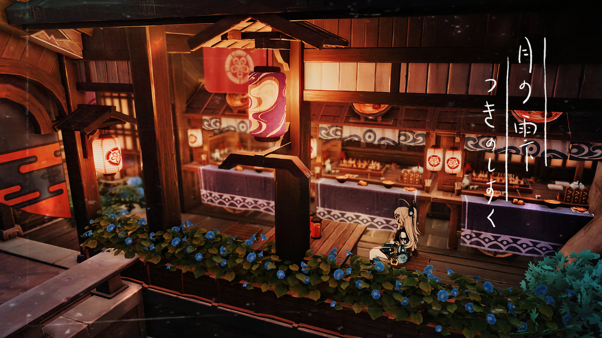
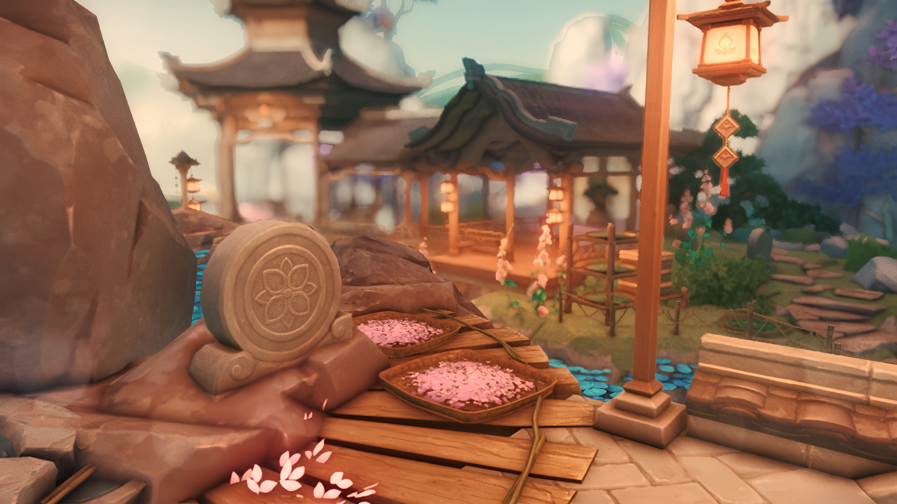
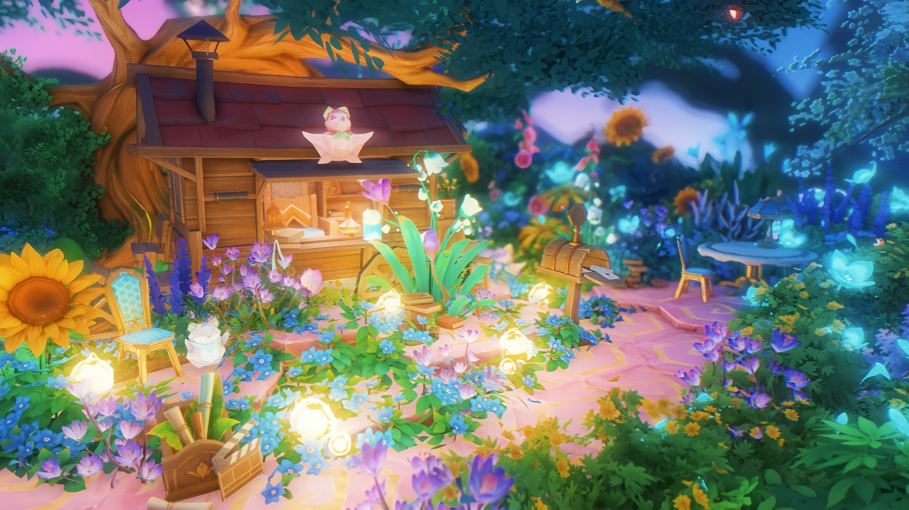
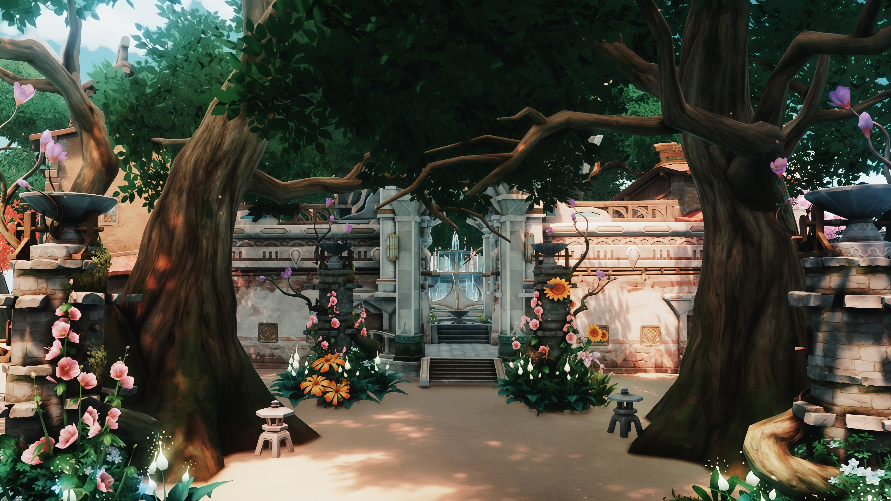
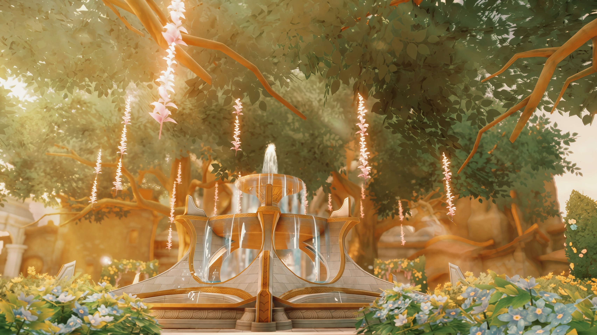
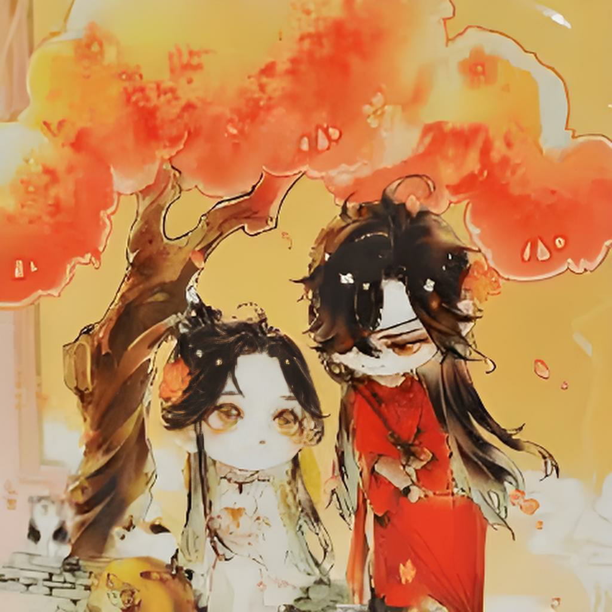

  <h1 class="header">HoYoShade</h1>
  <h3>
    登峯造極，終抵銀河。
  </h3>

  

[EN](Readme.md)|[简体中文](Readme.Chinese_Simplified.md)|**繁體中文**  

<!-- 讓孩子恰點飯吧，孩子想賺點錢玩Cosplay，還想去上海原神FES QAQ；感謝家人們。 -->  

> [!TIP]
> 嗨！你是miHoYo（米哈遊）/ HoYoverse官方合約創作者嗎？
> 
> 如果你在使用後認爲HoYoShade對你的創作之路非常有幫助，你可以選擇購買我們的**創作者計劃（CREATOR PERMIUM）**，以此讓你的HoYoShade在遊戲內獲得更加強大的功能，同時這也是我們獲得收入的另一種渠道，也是你向HoYoShade貢獻者表達支持的另一種方式。助你的創作之路更加順利！
>
> 如需購買，**請使用中國大陸地區可用的聯繫方式（最好是QQ）：**[**聯繫我們**](#〢-聯繫我)
>
> 請注意：**創作者計劃（CREATOR PERMIUM）** 所提供的HoYoShade均爲閉源+加密代碼，而非本倉庫的開源源碼。你不可以通過**創作者計劃（CREATOR PERMIUM）** 所提供的HoYoShade進行源代碼的二次開發/發行/分發。

> [!TIP]
> 需要在其它反作弊系統嚴格的遊戲中可靠的注入ReShade？我們開發了更加抗封鎖及抗檢測的注入內核。截至目前，已獲得部分其他遊戲廠商官方合約創作者/博主的支持，且已經歷時間的檢驗。你可以選擇購買此注入內核的使用權以此實現你的目的，同時這也是我們獲得收入的另一種渠道，也是你向HoYoShade貢獻者表達支持的另一種方式。
>
> 如需購買，**請使用中國大陸地區可用的聯繫方式（最好是QQ）：**[**聯繫我們**](#〢-聯繫我)
>
> 請注意：**此項付費增值服務**所提供的ReShade均爲閉源+加密代碼，而非本倉庫的開源源碼。你不可以通過**此項付費增值服務**所提供的ReShade進行源代碼的二次開發/發行/分發。

<!-- 讓孩子恰點飯吧，孩子想賺點錢玩Cosplay，還想去上海原神FES QAQ；感謝家人們。 -->  

> [!NOTE]
> ·翻譯並非100%準確，翻譯工作主要基於OpenAI-GPT4o，谷歌翻譯和本人的校對組成。 但即使如此，最終成品也難免會產生一定的問題。 如果你發現或者你認爲這是一個問題，請提交issues以幫助HoYoShade改進。 
>  
> ·由於HoYoShade收到了DMCA警告，你無法再從Release界面下載低於V2.013.0 Stable版本的HoYoShade。有關詳細情況，請查看[關於DMCA](#〢-關於DMCA)界面。   
> 
> ·對於Readme.md及HoYoShade在各平臺的官方社羣中所使用的所有來源於第三者的視頻/圖片展示均以獲得創作者/有關第三者的授權。創作者/有關第三者均表示在創作過程中使用了HoYoShade，並知曉相關內容將會用於展示。

> [!IMPORTANT]
> · 截至目前，HoYoShade唯一的盈利手段只有以下手段：
> 
> - [**向開發者贊助**](#〢-贊助)
> - [**向開發者購買HoYoShade創作者計劃（CREATOR PERMIUM）**](#〢-聯繫我)
> - [**向開發者購買友商遊戲注入內核使用權**](#〢-聯繫我)
> 
> 如果你從第三者/店鋪/平臺購買了本Mod，請立即[**向我們報告**](#〢-聯繫我)，並立刻要求該第三者/店鋪/平臺進行退款。如有必要，請保留/固定相關證據，並向你所在地區的執法/司法單位進行報案。

## 〢 視頻展示

  <h1 class="header">來自 阿向菌|AXBro</h1>
  <h3>
    Night,Diluc 雨夜，迪盧克實拍短片
  </h3>

https://github.com/user-attachments/assets/a9c96088-66fe-4cb4-b189-d61c82eb3503

點擊按鈕：  

  <h3>
    Amidst the tempest, a glimpse into the storm-swept realm of Inazuma. 於暴雨中 稻妻實機
  </h3>

https://github.com/user-attachments/assets/968dc71c-5898-4472-a111-fa49d277a410

  <h3>
    The art of rendering. 渲染的藝術
  </h3>

https://github.com/user-attachments/assets/9143f492-d39e-4515-8ed6-c79924aa0cc5

點擊按鈕： 

  <h1 class="header">來自 白枝雪鴿|HoYo_Siraeda</h1>
  <h3>
    Just Another Day at the Section 6 | Fan-made short video | Zenless Zone Zero 絕區零同人實機短片 | 只是對空六課再平凡不過的一天...
  </h3>

https://github.com/user-attachments/assets/dc353d89-d479-43aa-b466-239a41e0173e

點擊按鈕：  

> [!NOTE]
> · 展示所使用的預設/效果庫可能經過了用戶自行添加/編輯。
>   
> · 本視頻中使用的其他模組從未在中國大陸以外的地區發行，且 HoYoShade 不包含這些附加功能。  
> 
> · 展示所使用的預設/效果庫/模組可能並未包含在HoYoShade Releases發行包中，如果你需要獲取展示裏所使用的預設/效果庫/模組，你可能需要向該創作者獲取相關內容。    
> 
> · 嗶哩嗶哩提供4K播放選項。如果你身處中國大陸，我們推薦你使用嗶哩嗶哩進行播放。  

## 〢 目錄

- [〢 視頻展示](#〢-視頻展示)
- [〢 目錄](#〢-目錄)
- [〢 介紹](#〢-介紹)
- [〢 警告](#〢-警告)
- [〢 支持遊戲列表](#〢-支持遊戲列表)
- [〢 來源](#〢-來源)
- [〢 OpenHoYoShade和HoYoShade](#〢-openhoyoshade和hoyoshade)
- [〢 如何安裝](#〢-如何安裝)
- [〢 推薦遊戲圖像設置](#〢-推薦遊戲圖像設置)
- [〢 截圖展示](#〢-截圖展示)
- [〢 關於DMCA](#〢-關於dmca)
- [〢 鳴謝](#〢-鳴謝)
- [〢 贊助](#〢-贊助)
- [〢 聯繫我](#〢-聯繫我)
- [〢 貢獻者](#〢-貢獻者)

## 〢 介紹

HoYoShade是一個基於官方ReShade二次開發的開源版本。

相較於官方ReShade，HoYoShade：

- 爲miHoYo（米哈遊）/HoYoverse旗下的所有遊戲及客戶端添加了額外的支持，提供了可靠和可量化的統一注入方案，避免了用戶因繞過反作弊系統/二改/不同配置下的分享的而付出額外的學習成本。
- 理論無視任何由miHoYo（米哈遊）/HoYoverse官方對旗下所有遊戲客戶端發行的大版本更新/熱更新。更新後可直接繼續使用HoYoShade。
- 爲大中華區內的國家及地區（中國大陸，香港，澳門，臺灣，新加坡）乃至亞太地區/亞洲提供了優秀的本土化、獨家功能及額外支持。
- 與衆多miHoYo（米哈遊）/HoYoverse官方合約創作者展開合作，創建了由衆多miHoYo（米哈遊）/HoYoverse官方合約創作者/原攝愛好者/玩家構成的社區。
- 針對miHoYo（米哈遊）/HoYoverse旗下的所有遊戲及客戶端的熱門模組，均針對性的進行了兼容/聯動開發工作。
- 針對miHoYo（米哈遊）/HoYoverse旗下的所有遊戲及客戶端製作了一些預設。（Presets）。
- 在某些國際網絡受限的國家及地區提供了相較於官方ReShade更高的可靠性和可用性。
- 儘可能在文件結構和使用體驗保持與官方ReShade一致，降低用戶學習成本。

ReShade的工作原理是攔截CPU和GPU之間的通信，並修改渲染信息以達到提高圖像質量的目的。

未來，HoYoShade將會支持更多的米哈遊遊戲。

HoYoShade集成了一些基於官方ReShade的開源項目並對其進行修改，具體列表請查看[來源頁面](#〢-來源)。

有關本倉庫貢獻者的信息，請訪問[貢獻者界面](#〢-貢獻者)

## 〢 警告

> [!Warning]
> ·受中國大陸地區當局政府的監管審查要求及政策因素，相較於國際服客戶端，由miHoYo（米哈遊）向中國大陸地區發行的專供客戶端針對性加強了對於模組和外掛的識別及檢測。所以，任何模組及外掛均有更大可能被米哈遊識別，這也意味着你的賬號更有可能會被封禁或導致其它嚴重後果。**沒有任何模組和外掛可以保證你的遊戲賬號可以絕對安全**。HoYoShade雖然可以運行在官方服務器的miHoYo（米哈遊）/HoYoverse遊戲上，但並不保證你的遊戲賬號絕對安全。如果您擔心您的遊戲賬號會被封禁，請考慮轉而在相對監測力度較低的國際服客戶端進行遊玩（由HoYoverse發行），或考慮搭建私服進行遊玩。  
> 
> ·在你將遊戲內容發送至其它任何人或者進行直播之前，HoYoShade建議你先使用其它Mod隱藏遊戲UID和用戶信息，並且不要將HoYoShade及其它模組界面展示給其它任何人。

> [!NOTE]
> ·HoYoShade建議你將你的顯卡和芯片組驅動更新至最新版本（如果可用），以獲得來自你設備製造商的最新支持以儘可能減少與圖形相關的問題，降低遊戲崩潰的幾率，並獲得來自設備製造商的最新支持。  
> 
> ·我們不建議你在官方服務器上運行HoYoShade。  
> 
> ·我們不建議你使用Beta(測試服)客戶端在官方服務器中運行HoYoShade，以免對HoYoShade全體開發者/全體二創開發者和你本人造成保密協議違約/違規/違法/經濟損失等風險。  
> 
> ·對於可能會發生的任何後果，HoYoShade全體開發者/全體二創開發者均不會承擔任何責任。  

## 〢 支持遊戲列表
  
**公開(REL)客戶端：**  
  
> [!NOTE]
> ·對於私服來說，如果私服所需的對應客戶端出現在下方支持的遊戲列表中，則說明HoYoShade可以提供支持。無需查看本地端是否支持ReShade/HoYoShade。  
> 
> ·我們不建議你在官方服務器上運行HoYoShade。  
> 
> ·對於並未出現在支持遊戲列表中的遊戲，你可以自行嘗試選擇使用注入器中已支持的遊戲/在開發者選項中選擇自定義注入來嘗試注入HoYoShade。  
> 
> ·HoYoShade支持同時與其它主流/熱門Mod一併注入，且不存在任何衝突問題。但請注意並確保其它遊戲Mod之間不會有衝突（例：原神無人機與GIMI，3DMingo/GIMI和甜瓜）。  
>
> ·受某些國家及地區當局政府的監管審查要求及政策因素，在某些國家和地區中（例如：越南），你所獲得的國際服客戶端可能並非由miHoYo（米哈遊）/HoYoverse發行，而是HoYoverse與當地遊戲發行商聯合發行/由當地遊戲發行商發行。此類客戶端除發行信息外，與正常由HoYoverse發行的國際服客戶端基本無異，並不會影響HoYoShade的注入支持。
> 
> ·原神無人機在每次原神遊戲版本更新後均需要等待適配，而HoYoShade理論無視遊戲版本更新。此問題與HoYoShade無關。
  
| 客戶端 | 是否已測試 | 是否支持 | 是否存在遊戲版本限制 |
| --- | --- | --- | --- |
| **原神(中國大陸服/天空島)** | 是 | 是 | 無遊戲版本限制 |
| **原神(嗶哩嗶哩服/世界樹)** | 是 | 是 | 無遊戲版本限制 |
| **原神(國際服)** | 是 | 是 | 無遊戲版本限制 |
| **原神(Epic遊戲商店版本)** | 是 | 是 | 無遊戲版本限制 |
| **崩壞3(中國大陸服)** | 是 | 是 | 無遊戲版本限制 |
| **崩壞3(中國大陸Steam服)** | 是 | 是 | 無遊戲版本限制 |
| **崩壞3(繁中服)** | 是 | 是 | 無遊戲版本限制 |
| **崩壞3(韓國服)** | 是 | 是 | 無遊戲版本限制 |
| **崩壞3(日本Steam服)** | 是 | 是 | 無遊戲版本限制 |
| **崩壞3(東南亞服)** | 是 | 是 | 無遊戲版本限制 |
| **崩壞3(歐美服)** | 是 | 是 | 無遊戲版本限制 |
| **崩壞:星穹鐵道(中國大陸服)** | 是 | 是 | 無遊戲版本限制 |
| **崩壞:星穹鐵道(嗶哩嗶哩服)** | 是 | 是 | 無遊戲版本限制 |
| **崩壞:星穹鐵道(國際服)** | 是 | 是 | 無遊戲版本限制 |
| **崩壞:星穹鐵道(Epic版本)** | 是 | 是 | 無遊戲版本限制 |
| **絕區零(中國大陸服/國際服客戶端)** | 是 | 是 | 無遊戲版本限制 |
  
**內測(CB/CBT/Beta)客戶端:**    
  
> [!NOTE]
> ·對於私服來說，如果私服所需的對應客戶端出現在下方支持的遊戲列表中，則說明HoYoShade可以提供支持。無需查看本地端是否支持ReShade/HoYoShade。  
>
> 通常來說，除版本號外，創作者體驗服(Creator Experience/CE/KOL)客戶端通常和同一版本時期下最後一個版本的Beta(測試服)/客戶端無異。
> 
> ·miHoYo（米哈遊）/HoYoverse在公測後面向測試者的Beta(測試服)/創作者體驗服客戶端通常客戶端版本號爲:X.5.X，X.X.Y(此處的X爲現行REL(公測/公開)版本號)，X.X.Y0(此處的X爲現行REL(公測/公開)版本號)等/通常會在文件加密/啓動器中有別於REL(公測/公開)客戶端/在版本號前綴有別於與REL(公測/公開)客戶端，請自行甄別你所持有的客戶端的版本及來源。  
> 
> ·HoYoShade理論上也可以對Beta(測試服)/創作者體驗服客戶端提供注入和運行支持，但我們對任何測試服客戶端的注入和運行支持不作成功性/功能性保證。  
> 
> ·我們不建議你使用Beta(測試服)/創作者體驗服客戶端在官方服務器中運行HoYoShade，以免對HoYoShade全體開發者/二創開發者和閣下本人造成保密協議違約/違規/違法/經濟損失等風險。   
> 
> ·除非下列表格中的選項爲"是"，否則這說明HoYoShade僅對該類型下被泄露出來的部分客戶端進行了測試並得出了支持的結論。這不代表所有版本/類型/來源的不同遊戲的內測客戶端均可運行HoYoShade，請自行測試。  
> 
> ·如果你正在使用的Beta(測試服)/創作者體驗服客戶端並不支持運行HoYoShade，並且你非常確定這並非是使用了錯誤的注入選項導致的問題，請在[issues界面](https://github.com/DuolaD/HoYoShade/issues)新建issues以幫助我們適配。或者使用啓動器的開發者功能嘗試自定義注入。  
> 
> ·對於並未出現在支持遊戲列表中的遊戲，你可以自行嘗試選擇使用注入器中已支持的遊戲/在開發者選項中選擇自定義注入來嘗試注入HoYoShade。    
> 
> ·原神無人機不可用於任何測試服客戶端。此問題與HoYoShade無關。  
  
| 客戶端 | 是否已測試 | 是否支持 | 是否存在遊戲版本限制 |
| --- | --- | --- | --- |
| **原神(海外 部分公測前內測客戶端)** | 已在部分被泄露的客戶端測試 | 已在部分被泄露的客戶端中測試並支持* | - |
| **原神(中國大陸 全部公測前內測客戶端)** | 已在部分被泄露的客戶端測試 | 已在部分被泄露的客戶端中測試並支持* | - |
| **原神(中國大陸/海外 公測後內測客戶端)** | 已在部分被泄露的客戶端測試 | 已在部分被泄露的客戶端中測試並支持* | - |
| **崩壞3(中國大陸/海外 公測後內測客戶端)** | 已在部分被泄露的客戶端測試 | 已在部分被泄露的客戶端中測試並支持* | - |
| **崩壞:星穹鐵道(中國大陸/海外 公測前內測客戶端)** | 已在部分被泄露的客戶端測試 | 已在部分被泄露的客戶端中測試並支持* | - |
| **崩壞:星穹鐵道(中國大陸/海外 公測後內測客戶端)** | 已在部分被泄露的客戶端測試 | 已在部分被泄露的客戶端中測試並支持* | - |
| **絕區零(中國大陸/海外 第一次/公測前內測)(0.10)** | 是 | 是* | 無遊戲版本限制 |
| **絕區零(中國大陸/海外 第二次公測前內測)(0.20)** | 是 | 是* | 無遊戲版本限制 |
| **絕區零(中國大陸獨佔 第三次公測前內測)(0.3X)** | 是 | 是* | 無遊戲版本限制 |
| **絕區零(中國大陸/海外 第四次公測前內測)(0.3X)** | 是 | 是* | 無遊戲版本限制 |
| **絕區零(中國大陸/海外 公測後內測客戶端)(X.X.X/X.X.X0)** | 已在部分被泄露的客戶端測試 | 已在部分被泄露的客戶端中測試並支持* | - |

*:可能需要向開發者獲取額外補丁方可注入。

**創作者體驗服(Creator Experience/CE/KOL)客戶端:**    
  
> [!NOTE]
> ·對於私服來說，如果私服所需的對應客戶端出現在下方支持的遊戲列表中，則說明HoYoShade可以提供支持。無需查看本地端是否支持ReShade/HoYoShade。  
>
> 通常來說，除版本號外，創作者體驗服(Creator Experience/CE/KOL)客戶端通常和同一版本時期下最後一個版本的Beta(測試服)/客戶端無異。
>
> ·miHoYo（米哈遊）/HoYoverse在公測後面向測試者的Beta(測試服)/創作者體驗服客戶端通常客戶端版本號爲:X.5.X，X.X.Y(此處的X爲現行REL(公測/公開)版本號)，X.X.Y0(此處的X爲現行REL(公測/公開)版本號)等/通常會在文件加密/啓動器中有別於REL(公測/公開)客戶端/在版本號前綴有別於與REL(公測/公開)客戶端，請自行甄別你所持有的客戶端的版本及來源。  
> 
> ·HoYoShade理論上也可以對Beta(測試服)/創作者體驗服客戶端提供注入和運行支持，但我們對任何測試服客戶端的注入和運行支持不作成功性/功能性保證。  
> 
> ·我們不建議你使用Beta(測試服)/創作者體驗服客戶端在官方服務器中運行HoYoShade，以免對HoYoShade全體開發者/二創開發者和閣下本人造成保密協議違約/違規/違法/經濟損失等風險。  
> 
> ·除非下列表格中的選項爲"是"，否則這說明HoYoShade僅對該類型下被泄露出來的部分客戶端進行了測試並得出了支持的結論。這不代表所有版本/類型/來源的不同遊戲的內測客戶端均可運行HoYoShade，請自行測試。  
> 
> ·如果你正在使用的Beta(測試服)/創作者體驗服客戶端並不支持運行HoYoShade，並且你非常確定這並非是使用了錯誤的注入選項導致的問題，請在[issues界面](https://github.com/DuolaD/HoYoShade/issues)新建issues以幫助我們適配。或者使用啓動器的開發者功能嘗試自定義注入。  
> 
> ·對於並未出現在支持遊戲列表中的遊戲，你可以自行嘗試選擇使用注入器中已支持的遊戲/在開發者選項中選擇自定義注入來嘗試注入HoYoShade。    
> 
> ·原神無人機不可用於任何創作者體驗服客戶端。此問題與HoYoShade無關。  
  
| 客戶端 | 是否已測試 | 是否支持 | 是否存在遊戲版本限制 |
| --- | --- | --- | --- |
| **原神(中國大陸/海外 創作者體驗服客戶端)** | 已在部分被泄露的客戶端測試 | 已在部分被泄露的客戶端中測試並支持* | - |
| **崩壞:星穹鐵道(中國大陸/海外 創作者體驗服客戶端)** | 已在部分被泄露的客戶端測試 | 已在部分被泄露的客戶端中測試並支持* | - |
| **絕區零(中國大陸/海外 創作者體驗服客戶端)** | 已在部分被泄露的客戶端測試 | 已在部分被泄露的客戶端中測試並支持* | - |

*:可能需要向開發者獲取額外補丁方可注入。

<!-- 問題不大，如果不支持的話我應該也會第一時間知道消息的 XD。 -->  
<!-- 針對DevKit客戶端的支持...就沒啥寫的必要了吧...... -->  

## 〢 來源

**當前正在使用的資源：**

| 名字 | 介紹 | 網址 |
| --- | --- | --- |
| **ReShade官方** | HoYoShade會保證最新發行版中的ReShade總是和ReShade最新版本保持一致 | [官方倉庫](https://github.com/crosire/reshade) \ [官方網站](https://reshade.me) |
| **來自Crosire的ReShade注入器（經過修改）** | 一個支持 ReShade 注入到 miHoYo（米哈遊）/HoYoverse 遊戲客戶端的注入器。並進行修改以使其更易於使用。 | [官方倉庫](https://github.com/crosire/reshade) \ [前往ReShade官方倉庫查看源碼](https://github.com/crosire/reshade/blob/main/tools/injector.cpp) \ [前往HoYoShade倉庫查看經過我們修改後的源碼](https://github.com/DuolaD/HoYoShade/blob/V2.X.X-Stable/inject_mod.cpp) |
| **MiSans系列字體** | HoYoShade默認字體，版權歸小米集團所有。  | [官方網站](https://www.mi.com) \ [MiSans系列字體官方網站](https://hyperos.mi.com/font/) |
| **miHoYo（米哈遊）/ HoYoverse旗下游戲客戶端字體** | HoYoShade內置可選字體，從遊戲客戶端中提取。版權歸miHoYo（米哈遊）/ HoYoverse所有。  | [miHoYo官方網站](https://www.mihoyo.com) \ [HoYoverse官方網站](https://www.hoyoverse.com) |

**已過時的資源：**

| 名字 | 介紹 | 網址 |
| --- | --- | --- |
| **微軟雅黑** | HoYoShade V2.5.1 Stable以及更早版本的默認字體，版權歸微軟集團所有。由於潛在的版權風險問題，現已棄用。(僅用於V2.5.1 Stable和更早版本) | [官方網站](https://www.microsoft.com) |
| **Aria2** | 用於非強制版本檢測器下載版本信息和最新Mod包。由於版本信息同步問題，現已棄用。(僅用於V2.0131.0 Stable至V2.11.3 Stable中) | [官方倉庫](https://github.com/aria2/aria2) \ [官方網站](https://aria2.github.io/) |

## 〢 OpenHoYoShade和HoYoShade

我們自發行V2.012.2 Stable版本開始，會隨着HoYoShade版本更新一併發佈OpenHoYoShade。  

相較於HoYoShade：

- OpenHoYoShade爲HoYoShade底層基本框架，它涵蓋了使ReShade注入至miHoYo（米哈遊）/HoYoverse旗下的所有遊戲及客戶端的所有必要文件。  
- OpenHoYoShade存儲佔用會比HoYoShade小, 但OpenHoYoShade並沒有內置ReShade效果庫，預設等，適用於想對HoYoShade進行二次開發的二次開發者。  

如果你只是想在miHoYo（米哈遊）/HoYoverse遊戲下使用ReShade，請下載HoYoShade。    

如果你想要開發一個可以在miHoYo（米哈遊）/HoYoverse遊戲下使用的ReShade，但是你又不想學習過多的東西，那麼你可以選擇下載OpenHoYoShade。  

要使 OpenHoYoShade 快速工作，您唯一需要做的就是將效果庫和預設放在各自正確的位置。  
但如果你願意，你可以進行進一步的開發，比如注入器、Reshade.ini構建器等，甚至重新發行！（開源萬歲！)  

**在你重新發行文件時，確保你重新發行的文件遵守了BSD-3開源協議**

當然了,如果你想要獲得舊版注入程序/更多信息，請查看Commit歷史記錄，或拉取本倉庫。

如果你還是不明白OpenHoYoShade和HoYoShade之間有什麼不同，  
那麼以下的圖表也許可以很好的幫助你說明：

|  | OpenHoYoShade | HoYoShade |
| --- | --- | --- |
| **ReShade** | 有 | 有 |
| **使ReShade注入至全系米哈遊旗下游戲的所有必要文件** | 有 | 有 |
| **程序源代碼** | 有 | 沒有（但源代碼將與HoYoShade倉庫及OpenHoYoShade內的源代碼文件保持一致） |
| **Reshade的效果庫(包括插件)** | 沒有(你需要自行準備) | 有 |
| **預設** | 沒有(你需要自行準備) | 有 |
| **誰會需要他們？** | 二次開發者 | 普通遊戲玩家 |

## 〢 如何安裝

從[本倉庫的發行頁面](https://github.com/DuolaD/HoYoShade/releases/latest)下載最新版本的(Open)HoYoShade.  
解壓後按照zip壓縮包內的教程操作即可  

  對文字版教程感到困惑嗎？點擊按鈕在或者在觀看視頻版教程*。  

 

*：僅提供簡體中文/繁體中文版本。

## 〢 推薦遊戲圖像設置

> [!NOTE]
> ·這裏推薦的圖像設置是基於《原神》作爲參考的。您可以使用這些推薦的圖形設置來修改其他米哈遊遊戲的圖像設置，或者您也可以選擇自定義圖像設置。  
> ·如果您的顯卡性能低於NVIDIA GTX系列水平，則不建議您使用HoYoShade和FPS解鎖。

| 設置 | 比NVIDIA GTX系列性能低的顯卡 | 英偉達GTX系列或其他同等級別的顯卡 | 英偉達RTX系列或其他同等級別的顯卡 |
| --------------------------- | --------------------------------- |------------------------------------ |:------------------------------------ |
| **分辨率** | 1920x1080 (或更高) | 1920x1080 (或更高) | 1920x1080 (或更高) |
| **亮度** | 默認值（您可以選擇將亮度減少兩到三個點） | 默認值（您可以選擇將亮度減少兩到三個點） | 默認值（您可以選擇將亮度減少兩到三個點）| 默認值（您可以選擇將亮度減少兩到三個點）|
| **幀率** | 60 | 60 | 60 (使用FPS解鎖器或其它類似的模組可以獲得更高的幀率) |
| **垂直同步** | 關閉（如果畫面有撕裂感，請啓用此選項） | 關閉（如果畫面有撕裂感，請啓用此選項） | 關閉（如果畫面有撕裂感，請啓用此選項）|
| **渲染精度** | 0.6~1.0 | 0.6~1.1 | 1.5 (如果您的遊戲幀率在設置爲1.5後無法穩定在60，請將其設置爲1.1或1.0) |
| **陰影質量** | 極低 或 低 | 中 | 高 |
| **後期效果** | 極低 或 低 | 中 | 高 |
| **特效質量** | 極低 或 低 | 中 | 高 |
| **場景細節** | 極低 或 低 | 中 或 高 | 高 或 極高 |
| **抗鋸齒** | 關閉 or FSR 2 | FSR 2 | SMAA/FXAA (如果您的幀率在選擇SMAA/FXAA後偏低，請使用 FSR 2) |
| **體積霧** | 關閉 | 開啓(你可以選擇關閉) | 開啓 |
| **反射** | 關閉 | 開啓(你可以選擇關閉) | 開啓 |
| **動態模糊** | 關閉 或 低 | 低 或 高 | 高 或 非常高 |
| **Bloom** | 開啓(你可以選擇關閉) | 開啓(你可以選擇關閉) | 開啓(你可以選擇關閉) |
| **人羣密度** | 低 | 低 或 高 | 高 |
| **多人遊戲隊友特效** | 完全屏蔽 | 打開 | 打開 |
| **次表面散射** | 關閉 | 中 或 高 | 高 |
| **各向異性採樣** | 16x | 16x | 16x |

> [!Warning]
> 請注意，在一般情況下，大多數的FPS解鎖器都會要求你不要在使用FPS解鎖器的情況下更改遊戲中的幀率設置。

## 〢 截圖展示

  <h1 class="header">來自 阿向菌|AXBro</h1>

  
  
  

  <h1 class="header">由HoYoShade用戶拍攝</h1>

  
  
  
  
  
  
  
  
  
  
  
  
  
  
  
  
  
  
  

感謝以下所有創作者對本項目的展示界面所做出的貢獻！   

    <table>
    <tr>
            <td>
                <h3>阿向菌|AXBro</h3>
                <a href="https://www.youtube.com/@AXBroCN">
                    
                <h6>創作內容：</h6>
                <a href="https://www.youtube.com/watch?v=hNBKZw4eVBM">Rainy Night,Diluc_雨夜，迪盧克實拍短片</a> 
		<a href="https://v.douyin.com/iU376NNM">Amidst the tempest, a glimpse into the storm-swept realm of Inazuma. 於暴雨中 稻妻實機</a> 
		<a href="https://v.douyin.com/iU37P4aK">The art of rendering. 渲染的藝術</a> 
		<a href="Readme.md-image/AXBro-1.jpg">截圖展示1</a> 
		<a href="Readme.md-image/AXBro-2.jpg">截圖展示2</a> 
		<a href="Readme.md-image/AXBro-3.jpg">截圖展示3</a> 
                </a>
            </td>
            <td>
        <a href="https://www.hoyolab.com/accountCenter/postList?id=368916437">HoYoLAB個人主頁</a> 
        <a href="https://www.youtube.com/@AXBroCN">YouTube頻道</a> 
        <a href="https://www.tiktok.com/@axbrocn?_r=1&_d=eaij8279i83mcl&sec_uid=MS4wLjABAAAAv9yK1VQOks5sB_wbFyXogwDO909TuxhAZ-e-qnpFlMiZ1B4FTIGrh9jdg5KTsuMr&share_author_id=7293608271650030634&sharer_language=en&source=h5_m&u_code=eaij8b3012e2l5&ug_btm=b8727%2Cb0&sec_user_id=MS4wLjABAAAAv9yK1VQOks5sB_wbFyXogwDO909TuxhAZ-e-qnpFlMiZ1B4FTIGrh9jdg5KTsuMr&utm_source=copy&social_share_type=4&utm_campaign=client_share&utm_medium=ios&tt_from=copy&user_id=7293608271650030634&share_link_id=9E0D9FA7-E376-4EAA-B1A1-21F25EE8A746&share_app_id=1233">TikTok頻道</a> 
        <a href="https://space.bilibili.com/436127696">嗶哩嗶哩頻道</a>
        </td>
        </tr>
        <tr>
	<td>
  	<h3>白枝雪鴿|HoYo_Siraeda</h3>
		<a href="https://space.bilibili.com/375807068">
		
		<h6>創作內容：</h6>
		<a href="https://www.youtube.com/watch?v=zZKg6ep4Kvg">Just Another Day at the Section 6 | Fan-made short video | Zenless Zone Zero 絕區零同人實機短片 | 只是對空六課再平凡不過的一天...</a> 
		</a>
    </td>
    <td>
        <a href="https://www.youtube.com/@HoYo_Siraeda">YouTube頻道</a> 
        <a href="https://v.douyin.com/_0oRPA6kJ2A">抖音頻道</a> 
        <a href="https://space.bilibili.com/375807068">嗶哩嗶哩頻道</a>
	  </td>
    </tr>
    <tr>
	<td>
		<h3>WatchAndyTW</h3>
		<a href="https://github.com/WatchAndyTW">
		
		<h6>創作內容：</h6>
		<a href="Readme.md-image/ScreenShot1.png">截圖展示1</a> 
		</a>
	    </td>
	<td>
		<a href="https://github.com/WatchAndyTW">WatchAndyTW的GitHub主頁</a> 
	</td>
	</tr>
	<tr>
	<td>
		<h3>攝影：枝枝</h3>
		<h3>塵歌壺場景來源：衣賢珊、H小距離、風-笑塵、雲端遇夢深、花鏡</h3>
		
		
		
		
		
		<h6>創作內容：</h6>
		<a href="Readme.md-image/ScreenShot4.jpg">截圖展示4</a> 
		<a href="Readme.md-image/ScreenShot5.jpg">截圖展示5</a> 
		<a href="Readme.md-image/ScreenShot6.png">截圖展示6</a> 
		<a href="Readme.md-image/ScreenShot7.jpg">截圖展示7</a> 
		<a href="Readme.md-image/ScreenShot8.jpg">截圖展示8</a> 
		<a href="Readme.md-image/ScreenShot9.png">截圖展示9</a> 
		<a href="Readme.md-image/ScreenShot10.jpg">截圖展示10</a> 
		<a href="Readme.md-image/ScreenShot11.jpg">截圖展示11</a> 
		<a href="Readme.md-image/ScreenShot12.jpg">截圖展示12</a> 
		<a href="Readme.md-image/ScreenShot13.jpg">截圖展示13</a> 
		<a href="Readme.md-image/ScreenShot14.jpg">截圖展示14</a> 
		<a href="Readme.md-image/ScreenShot15.jpg">截圖展示15</a> 
		<a href="Readme.md-image/ScreenShot16.jpg">截圖展示16</a> 
		<a href="Readme.md-image/ScreenShot17.jpg">截圖展示17</a> 
		<a href="Readme.md-image/ScreenShot18.jpg">截圖展示18</a> 
		<a href="Readme.md-image/ScreenShot19.jpg">截圖展示19</a> 
		</a>
	    </td>
	<td>
		<a href="https://user.qzone.qq.com/29153360">枝枝的QQ空間主頁</a> 
		<a href="https://space.bilibili.com/510178318">衣賢珊的嗶哩嗶哩頻道</a> 
		<a href="https://space.bilibili.com/23559567">H小距離的嗶哩嗶哩頻道</a> 
		<a href="https://space.bilibili.com/1803227895">風-笑塵的嗶哩嗶哩頻道</a> 
	</td>
	</tr>
         
         
        </td>
    </table>

 

> [!NOTE]
> · 出於部分創作者的要求/MCN中間機構規定/miHoYo（米哈遊）或HoYoverse合約創作者規定，除非得到明確答覆，否則此名單中將僅展示同意進行展示的創作者。部分使用HoYoShade進行創作/展示的創作者將不會出現在此列表中。  
> 
> · 展示所使用的預設/效果庫可能經過了用戶自行添加/編輯。
>   
> · 展示中所使用的其他模組可能並非來自 HoYoShade，且 HoYoShade 不包含這些附加功能。   
> 
> · 展示所使用的預設/效果庫可能並未包含在HoYoShade Releases發行包中，如果你需要獲取展示裏所使用的預設/效果庫/模組，你可能需要向該創作者獲取相關內容。  

## 〢 關於DMCA
由於HoYoShade收到了DMCA警告，你無法再從Release界面下載低於V2.013.0 Stable版本的HoYoShade。  

不受到影響的內容有：  
V1.0.0 Stable  
OpenHoYoShade[All]  
2.012.1_2.012.2_hdiff.zip  

## 〢 鳴謝
感謝以下合作伙伴的支持：  
| 名字 | 介紹 | 網址 |
| --- | --- | --- |
| **CY Team** | HoYoShade合作伙伴/微軟企業存儲計劃提供 | [官方網站](https://www.cyteam.cn/) |
| **Cloudflare, Inc.** | 域名託管和管理 | [官方網站](https://www.cloudflare.com/) |

## 〢 贊助

 **點擊對應按鈕來贊助HoYoShade**  
贊助的金額由你自行設定。

[**點擊前往我的GitHub個人首頁Readme.md向我提供贊助**](https://github.com/DuolaD/DuolaD/blob/main/Readme.Chinese_Simplified.md)

## 〢 聯繫我

> [!NOTE]
> ·如果你處於中國大陸地區，則某些聯繫方式可能不可用。結尾帶星號標識'*'的聯繫方式可以保證在中國大陸地區使用，並且可以獲得更快速的響應和支持。  
> 
> ·如果你在使用此模組時有任何的問題，我們建議先在本倉庫創建一個issue。

[**點擊前往我的GitHub個人首頁Readme.md聯繫我**](https://github.com/DuolaD/DuolaD/blob/main/Readme.Chinese_Simplified.md)

## 〢 貢獻者
我們真誠的感謝以下所有出色的貢獻者，以及與我們進行合作的miHoYo（米哈遊）/HoYoverse官方合約創作者，各贊助商/贊助者，還有各位使用HoYoShade的你們。HoYoShade因你們而精彩！

感謝所有貢獻者對本項目的無私貢獻！

    <table>
        <tr>
            <td>
                <h3>DuolaDStudio Hong Kong Ltd.</h3>
                
		<h3>也就是以下成員：</h3>
		<h5>哆啦D夢|DuolaD & 琳尼特|LynetteNotFound</h5>
		<a href="https://github.com/DuolaD"></img></a>
		
            </td>
	    <td>
                <a href="https://github.com/DuolaDStudio">組織的GitHub主頁</a> 
		<a href="https://github.com/DuolaD">哆啦D夢|DuolaD的GitHub個人主頁</a> 
		<a href="https://github.com/LynetteNotFound">琳尼特|LynetteNotFound的GitHub個人主頁</a> 
		 
		<a>注意:哆啦D夢|DuolaD其它個人主頁鏈接見上;</a> 
		<a>琳尼特|LynetteNotFound沒有公開聯繫方式</a>
            </td>
	</tr>
        <tr>
            <td>
                <h3>阿向菌|AXBro</h3>
                
            </td>
            <td>
		<a href="https://www.hoyolab.com/accountCenter/postList?id=368916437">HoYoLAB個人主頁</a> 
		<a href="https://www.youtube.com/@AXBroCN">YouTube頻道</a> 
                <a href="https://www.tiktok.com/@axbrocn?_r=1&_d=eaij8279i83mcl&sec_uid=MS4wLjABAAAAv9yK1VQOks5sB_wbFyXogwDO909TuxhAZ-e-qnpFlMiZ1B4FTIGrh9jdg5KTsuMr&share_author_id=7293608271650030634&sharer_language=en&source=h5_m&u_code=eaij8b3012e2l5&ug_btm=b8727%2Cb0&sec_user_id=MS4wLjABAAAAv9yK1VQOks5sB_wbFyXogwDO909TuxhAZ-e-qnpFlMiZ1B4FTIGrh9jdg5KTsuMr&utm_source=copy&social_share_type=4&utm_campaign=client_share&utm_medium=ios&tt_from=copy&user_id=7293608271650030634&share_link_id=9E0D9FA7-E376-4EAA-B1A1-21F25EE8A746&share_app_id=1233">TikTok頻道</a> 
		<a href="https://space.bilibili.com/436127696">嗶哩嗶哩頻道</a>
            </td>
        </tr>
        <tr>
            <td>
                <h3>REL(Ex_M)</h3>
                
            </td>
            <td>
                <a href="https://github.com/34736384">GitHub個人主頁</a> 
		<a href="https://space.bilibili.com/44434084?spm_id_from=333.337.0.0">BiliBili頻道</a>
            </td>
        </tr>
    </table>

