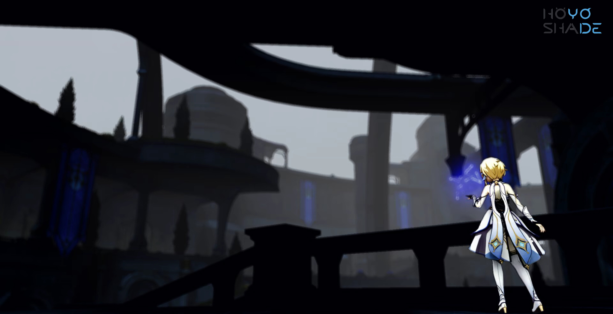

  <h1 class="header">HoYoShade</h1>
  <h3>
    Reaching the peak of perfection together to see the Milky Way.
  </h3>

  

EN|[简体中文](README.Chinese_Simplified.md)|[繁體中文](README.Chinese_Traditional.md)  

## 〢 Directory

- [Introduction](#〢-Introduction)
- [Information](#〢-Information)  
- [Sources](#〢-Sources)
- [How to install?](#〢-How-to-install?)
- [Recommended Graphics settings for game](#〢-Recommended-Graphics-settings-for-game)
- [Screenshots](#〢-Screenshots)
- [Contributors](#〢-Contributors)

## 〢 Introduction

An Unofficial ReShade For All HoYoVerse Games on PC.

The working principle of Reshade is to intercept communication between the CPU and GPU and modify image information to improve image quality. This repository's ReShade integrates some open-source projects based on the official ReShade (for the specific list please check the [Sources Page](#〢-Sources)), making it compatible with all HoYoVerse games on PC and creating some targeted presets. In the future, it will support more HoYoVerse games.

Please refer to the [Contributors Page](#〢-Contributors) for information about contributors to this repository.

## 〢 Information

> [!Warning]
> The Genshin Impact game in mainland China has strengthened its identification of mods and cheats by connecting to Tencent's anti-cheating system. This means that any mods or cheats are more likely to be identified by HoYoVerse,
and consequently, your account is more likely to be banned or face other serious consequences. 
No mod or cheat can guarantee the absolute safety of your game account. 
Although HoYoShade can run on the official servers of HoYoVerse games,
it does not guarantee the absolute safety of your game account.

> [!Warning]
> Before sharing game content with anyone else or streaming, HoYoShade recommends using other mods to hide your game UID and user information, and not to display HoYoShade or other mod interfaces to anyone else.

> [!NOTE]
> In addition, HoYoShade recommends updating your graphics card and chipset drivers to the latest version (if available) to minimize graphics-related issues prevent game crashes, and receive the latest support from your device manufacturer.

> [!NOTE]
> Contributors to the HoYoShade repository and all contributors who have developed based on HoYoShade will not be responsible for any consequences that may occur when running HoYoShade on the official servers of HoYoVerse games.

## 〢 Sources

| Name | information | URL address |
| --- | --- | --- |
| **ReShade Official** | Always the latest Version | [Official Repository](https://github.com/crosire/reshade),[Official Website](https://reshade.me/) |
| **Crosire's DLL injector** | Just an injector | [View source code in ReShade Official Repository](https://github.com/crosire/reshade/blob/main/tools/injector.cpp) |
| **All Paid ReShade-Shaders by Pascal Gilcher** | Available for all HoYoShade V2.X.X Version for free | [View Patreon Page](https://www.patreon.com/mcflypg/posts) |

## 〢 How to install?

Old:
Download this mod on [GitHub release page.](https://gitee.com/DuolaD/HoYoShade/releases) or [Gitee release page.](https://github.com/DuolaD/HoYoShade/releases).  
unzip it.  
Follow the tutorial in the zip.  

New:(Still waiting for the GUI to be built completely.)

## 〢 Recommended Graphics settings for game

> [!NOTE]
> The recommended graphics settings here are based on Genshin Impact as a reference. You can use these recommended graphics settings to modify the graphics settings of other HoYoVerse games, or you can also choose to customize the graphics settings yourself.

> [!NOTE]
> If your graphics card performance is lower than the NVIDIA GTX series level, then it is not recommended for you to use HoYoShade and FPS unlock.

| Settings| A graphics card with lower performance than the NVIDIA GTX series | The NVIDIA GTX series or other graphics cards of the same level | The NVIDIA RTX series or other graphics cards of the same level |
| --------------------------- | --------------------------------- |------------------------------------ |:------------------------------------ |
| **Display Mode** | 1920x1080 (or higher) | 1920x1080 (or higher) | 1920x1080 (or higher) |
| **Brightness** | Default(You can choose to decrease the brightness by two to three points.)| Default(You can choose to decrease the brightness by two to three points.) | Default(You can choose to decrease the brightness by two to three points.)| Default(You can choose to decrease the brightness by two to three points.)|
| **FPS** | 60 | 60 | 60 (Use FPS Unlocker or another similar Mod can get more FPS) |
| **V-Sync** | OFF(If there is a tearing feeling in the picture, please enable this option.)| OFF(If there is a tearing feeling in the picture, please enable this option.) | OFF(If there is a tearing feeling in the picture, please enable this option.)|
| **Render Resolution** | 0.6~1.0 | 0.6~1.1 | 1.5 (Set 1.1 or 1.0 if your game FPS can not be stable at 60 after set 1.5)|
| **Shadow Quality** | Lowest or Low | Medium | High |
| **Visual Effects** | Lowest or Low | Medium | High |
| **SFX Quality** | Lowest or Low | Medium | High |
| **Environment Detail** | Lowest or Low | Medium or High | High or Highest |
| **Anti-Aliasing** | OFF or FSR 2 | FSR 2 | SMAA/FXAA (Use FSR 2 if you have low FPS) |
| **Volumetric Fog** | OFF | On(You can choose switch OFF) | On |
| **Reflections** | OFF | On(You can choose switch OFF) | On |
| **Motion Blur** | OFF or Low| Low or High | High or Extreme |
| **Bloom** | On(You can choose switch OFF) | On(You can choose switch OFF) | On(You can choose switch OFF) |
| **Crowd Density** | Low | Low or High | High |
| **Co-Op Teammates Effects** | OFF | On | On |
| **Subsurface Scattering** | OFF | Medium or High | High |
| **Anisotropic Filtering** | 16x | 16x | 16x |

> [!Warning]
> Do not change FPS settings in the game if you are using FPS unlock.

## 〢 Screenshots

  <h1 class="header">Shot by [Youtube@AXBro阿向菌](https://www.youtube.com/@AXBroCN)</h1>

  
  
  

## 〢 Contributors
Thank you to all the collaborators for their dedication to the project!

    <h3>哆啦D夢|DuolaD</h3>
	
    <be>
    <h3>阿向菌|AXBro</h3>
	
    <be>
    <h3>REL</h3>
	
    <be>

