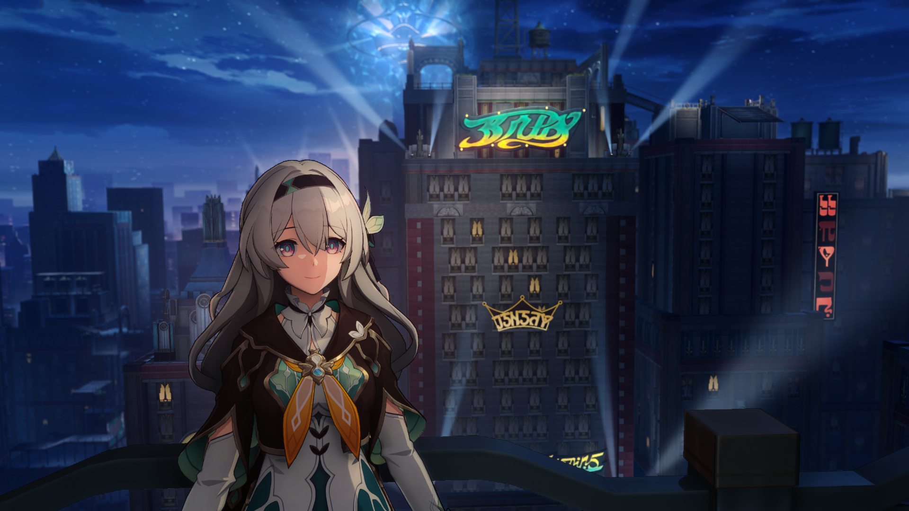
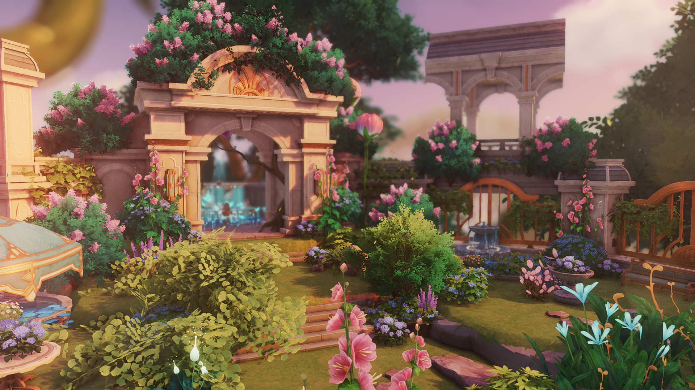
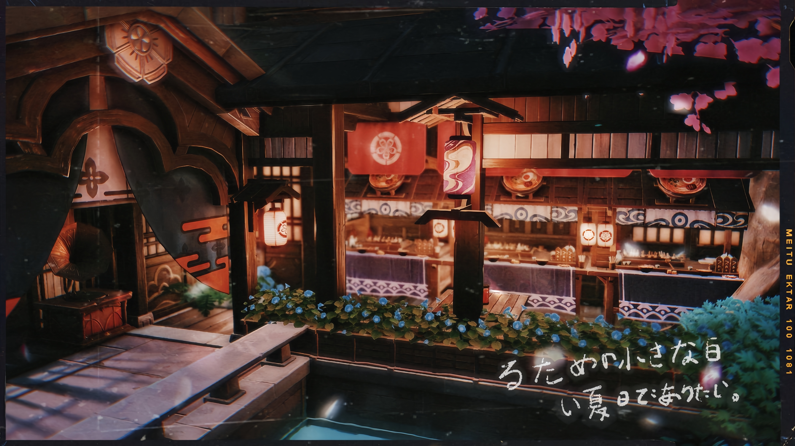
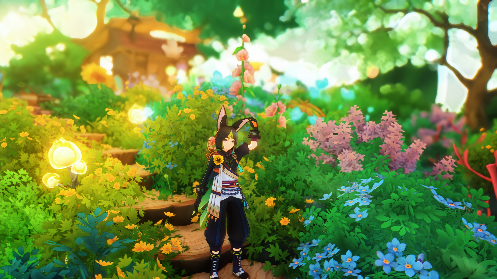
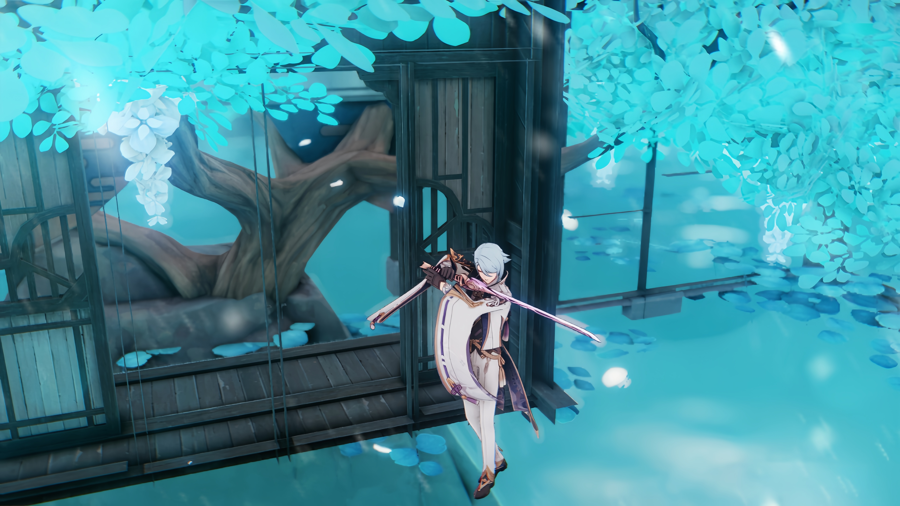
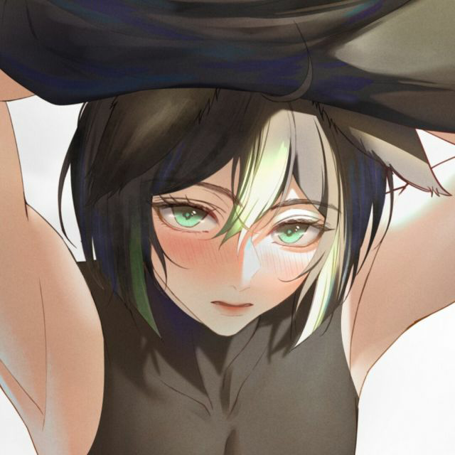

  <h1 class="header">HoYoShade</h1>
  <h3>
    Reaching the peak of perfection together to see the Milky Way.
  </h3>

  

**EN**|[简体中文](Readme.Chinese_Simplified.md)|[繁體中文](Readme.Chinese_Traditional.md)  

> [!NOTE]
> · The translation is not 100% accurate, as it is primarily based on OpenAI-GPT4o, Google Translate, and my proofreading. However, even so, the final result may still have some issues. If you find any problems or believe that there is an issue, please submit issues to help improve HoYoShade.  
> · Are you looking for an old version?we are developing [HoYoShade-RePublish](https://github.com/DuolaD/HoYoShade-RePublish) repo.Which when it done,you can download all old releases without all DMCA content. Sound good?    
> · Due to a DMCA warning received by HoYoShade, you can no longer download versions of HoYoShade lower than V2.013.0 Stable from the Release page.For more details, please check the [About DMCA](#〢-About-DMCA) page.  

## 〢 Live Demo

  <h1 class="header">Shot by 白枝雪鸽|HoYo_Siraeda</h1>
  <h3>
    Just Another Day at the Section 6 | Fan-made short video | Zenless Zone Zero
  </h3>

https://github.com/user-attachments/assets/dc353d89-d479-43aa-b466-239a41e0173e

Or Click to:   

> [!NOTE]
> · The presets/effect libraries shown in the screenshots may have been added/edited by the users.  
> · The other mods used in this video are not released outside of mainland China, and HoYoShade does not include these additional features.  
> · BiliBili provides 4K playback options. If you are in mainland China, we recommend you use BiliBili for playback.  

## 〢 Directory

- [〢 Live Demo](#〢-live-demo)
- [〢 Directory](#〢-directory)
- [〢 Introduction](#〢-introduction)
- [〢 Pre-Warning](#〢-pre-warning)
- [〢 Support games list](#〢-support-games-list)
- [〢 Sources](#〢-sources)
- [〢 OpenHoYoShade and HoYoShade](#〢-openhoyoshade-and-hoyoshade)
- [〢 How to install](#〢-how-to-install)
- [〢 Recommended Graphics settings for game](#〢-recommended-graphics-settings-for-game)
- [〢 Screenshots](#〢-screenshots)
- [〢 About DMCA](#〢-about-dmca)
- [〢 Thanks](#〢-thanks)
- [〢 Donate](#〢-donate)
- [〢 Contant Me](#〢-contant-me)
- [〢 Contributors](#〢-contributors)

## 〢 Introduction

An Unofficial ReShade For All HoYoVerse Games on PC.

The working principle of Reshade is to intercept communication between the CPU and GPU and modify image information to improve image quality. This repository's ReShade integrates some open-source projects based on the official ReShade (for the specific list please check the [Sources Page](#〢-Sources)), making it compatible with all HoYoVerse games on PC and creating some targeted presets. In the future, it will support more HoYoVerse games.

Please refer to the [Contributors Page](#〢-Contributors) for information about contributors to this repository.

## 〢 Pre-Warning

> [!Warning]
> ·The Genshin Impact/Yuanshen game in mainland China has strengthened its identification of mods and cheats by connecting to Tencent's anti-cheating system. This means that any mods or cheats are more likely to be identified by HoYoVerse, and consequently, your account is more likely to be banned or face other serious consequences. No mod or cheat can guarantee the absolute safety of your game account. Although HoYoShade can run on the official servers of HoYoVerse games,it does not guarantee the absolute safety of your game account.If you are worried that your game account will be banned, please consider setting up a private server.  
> ·Before sharing game content with anyone else or streaming, HoYoShade recommends using other mods to hide your game UID and user information, and not to display HoYoShade or other mod interfaces to anyone else.

> [!NOTE]
> · In addition, HoYoShade recommends updating your graphics card and chipset drivers to the latest version (if available) to minimize graphics-related issues prevent game crashes, and receive the latest support from your device manufacturer.  
> · We do not recommend running HoYoShade on official servers.  
> · We do not recommend using the Beta client to run HoYoShade on official servers to avoid the risk of confidentiality agreement breaches/violations/illegal activities/economic losses for all HoYoShade developers/secondary developers and yourself.  
> ·Contributors to the HoYoShade repository and all contributors who have developed based on HoYoShade will not be responsible for any consequences that may occur when running HoYoShade on the official servers of HoYoVerse games.  

## 〢 Support games list
  
REL(Releases) Client：  
  
> [!NOTE]
> ·For private server players, if the corresponding client required by the private server appears in the supported games list below, then HoYoShade can provide support.  
> ·We do not recommend that you run HoYoShade on official servers.  
> ·For games that do not appear in the supported games list, you can try to select a game that is already supported in the injector or choose custom injection in the developer options to try injecting HoYoShade.  
> ·HoYoShade supports simultaneous injection with other mainstream mods and there are no conflict issues. However, please note and ensure that there are no conflicts between other game mods.   
  
| Client | Tested | Support | Game Version restrictions |
| --- | --- | --- | --- |
| **Genshin Impact/YuanShen(CN Server)** | Yes | Yes | Unlimited |
| **Genshin Impact/YuanShen(BiliBili Server)** | Yes | Yes | Unlimited |
| **Genshin Impact/YuanShen(Global Server)** | Yes | Yes | Unlimited |
| **Genshin Impact/YuanShen(Epic Version)** | Yes | Yes | Unlimited |
| **Honkai Impact 3rd/BH3(CN Server)** | Yes | Yes | Unlimited |
| **Honkai Impact 3rd/BH3(CN Steam Server)** | Yes | Yes | Unlimited |
| **Honkai Impact 3rd/BH3(Traditional Chinese Server)** | Yes | Yes | Unlimited |
| **Honkai Impact 3rd/BH3(KR Server)** | Yes | Yes*1 | Unlimited |
| **Honkai Impact 3rd/BH3(JP Steam Server)** | Yes | Yes | Unlimited |
| **Honkai Impact 3rd/BH3(SEA Server)** | Yes | Yes | Unlimited |
| **Honkai Impact 3rd/BH3(Europe & Americas Servers)** | Yes | Yes | Unlimited |
| **Honkai: Star Rail/HSR(CN Server)** | Yes | Yes | Unlimited |
| **Honkai: Star Rail/HSR(BiliBili Server)** | Yes | Yes | Unlimited |
| **Honkai: Star Rail/HSR(Global Server)** | Yes | Yes | Unlimited |
| **Honkai: Star Rail/HSR(Epic Version)** | Yes | Yes | Unlimited |
| **Zenless Zone Zero/ZZZ (CN/OS Server Client)** | Yes | Yes | Unlimited |
  
CB/CBT(Close Beta Test)Client:    
  
> [!NOTE]
> ·For private server players, if the corresponding client required by the private server appears in the supported games list below, then HoYoShade can provide support.    
> ·MiHoYo/HoYoVerse's beta clients released to testers after the official release usually have client version numbers like: X.5.X, X.X.Y (where X is the current REL (Release) version number), X.X.Y0 (where X is the current REL (Releases) version number), etc. And they usually have different file encryption/launchers compared to REL (Release) clients. Please verify the version and source of the client you have.  
> ·HoYoShade theoretically can also provide injection and runtime support for the Beta version client, but we do not guarantee the success or functionality of injection and runtime support for any test server client.  
> ·We do not recommend that you use the beta client to run HoYoShade on official servers, to avoid the risk of violating confidentiality agreements/regulations/laws/economic losses for all HoYoShade developers/secondary developers and yourself.  
> ·Unless the option in the table below is "Yes," this indicates that HoYoShade has only been tested on some leaked clients of this type and has concluded that it is supported. This does not mean that all versions/types/sources of different game internal test clients can run HoYoShade. Please test it yourself.   
> ·If the test server client you are using does not support running HoYoShade, and you are very sure that this is not caused by using the wrong injection option, please create a new issue on the [issues pages](https://github.com/DuolaD/HoYoShade/issues) to help us adapt. Or use the developer function of the launcher to try custom injection.  
> ·For games that do not appear in the supported games list, you can try to select a game that is already supported in the injector or choose custom injection in the developer options to try injecting HoYoShade.  
  
| Client | Tested | Support | Game Version restrictions |
| --- | --- | --- | --- |
| **Genshin Impact/YuanShen(OS Part of Oversea CB Client Before Public Beta)** | Tested on some leaked clients | Tested and supported in some leaked clients* | - |
| **Genshin Impact/YuanShen(CN CB Client Before Public Beta)** | Tested on some leaked clients | Tested and supported in some leaked clients* | - |
| **Genshin Impact/YuanShen(CN/OS CB Client After Public Beta)** | Tested on some leaked clients | Tested and supported in some leaked clients* | - |
| **Honkai Impact 3rd/BH3(CN/OS CB Client After Public Beta)** | Tested on some leaked clients | Tested and supported in some leaked clients* | - |
| **Honkai: Star Rail/HSR(CN/OS CB Client After Public Beta)** | Tested on some leaked clients | Tested and supported in some leaked clients* | - |
| **Honkai: Star Rail/HSR(CN/OS CB Client After Public Beta)** | Tested on some leaked clients | Tested and supported in some leaked clients* | - |
| **Zenless Zone Zero/ZZZ(CN/OS 1st CB)(0.10)** | Yes | Yes* | Unlimited |
| **Zenless Zone Zero/ZZZ(CN/OS 2nd CB)(0.20)** | Yes | Yes* | Unlimited |
| **Zenless Zone Zero/ZZZ(CN Only 3rd CB)(0.3X)** | Yes | Yes* | Unlimited |
| **Zenless Zone Zero/ZZZ(CN/OS 4th CB)(0.3X)** | Yes | Yes* | Unlimited |
| **Zenless Zone Zero/ZZZ(CN/OS CB Client After Public Beta)(X.X.X/X.X.X0)** | Tested on some leaked clients | Tested and supported in some leaked clients* | - |
| **Honkai: Nexus Anima(CN/OS CB1 Client)** | Yes | Yes* | Unlimited |

*:You may need to obtain additional patches from the developer before you can inject.
  
## 〢 Sources

**Current resources:**

| Name | information | URL address |
| --- | --- | --- |
| **ReShade Official** | Always the latest Version. | [Official Repository](https://github.com/crosire/reshade) \ [Official Website](https://reshade.me/) |
| **Crosire's DLL injector with modded** | an injector to support ReShade inject to miHoYo/HoYoverse's game client. and modify to make it more easy to use.  | [Official Repository](https://github.com/crosire/reshade) \ [View source code in ReShade Official Repository](https://github.com/crosire/reshade/blob/main/tools/injector.cpp) \ [View our modded version source code in HoYoShade Repository](https://github.com/DuolaD/HoYoShade/blob/V2.X.X-Stable/inject_mod.cpp) |
| **MiSans series fonts** | HoYoShade default fonts, Copyright by Xiaomi Corporation.  | [Official Website](https://www.mi.com) \ [MiSans series fonts official website](https://hyperos.mi.com/font/) |
| **Fonts from miHoYo / HoYoVerse's game client** | HoYoShade build-in optional fonts, Copyright by miHoYo / HoYoVerse.  | [miHoYo official website](https://www.mihoyo.com) \ [HoYoverse official website](https://www.hoyoverse.com) | |

**Outdated resources:**

| Name | information | URL address |
| --- | --- | --- |
| **Microsoft YaHei** | HoYoShade default fonts in V2.5.1 Stable or older, Copyright by Microsoft Corporation. Deprecated due copyright issues. (Only available in V2.5.1 Stable or lower.) | [Official Website](http://microsoft.com) |
| **Aria2** | For the non-compulsory version detector to download version information and the latest Mod packages. Deprecated due version detail sync issues.(Only available in V2.0131.0 Stable to V2.11.3 Stable) | [Official Repository](https://github.com/aria2/aria2) \ [Official Website](https://aria2.github.io/) |

## 〢 OpenHoYoShade and HoYoShade

Since we publish V2.012.2 Stable,we start publish OpenHoYoShade with HoYoShade.  

OpenHoYoShade is the underlying basic framework of HoYoShade, which covers all the necessary files to inject ReShade into all miHoYo/HoYoverse games.  
OpenHoYoShade storage footprint is smaller than HoYoShade,  
However, OpenHoYoShade does not have a built-in ReShade effect library, presets, etc., which is suitable for secondary developers who want to redevelop HoYoShade. 

If you just want to use reshade in the MiHoYo/HoYoVerse games, download HoYoShade.  
If you want to develop your own reshade and hope it can work in the MiHoYo/HoYoVerse games, but you don't want to learn some peace of shit——  
then,check OpenHoYoShade.  

The only thing you need to do to make OpenHoYoShade work quickly is to put the effect library and presets in their respective places.  
But if you want, you can develop more, such as injector,Reshade.ini Builder, etc. even Redistribution!(Long live open source!)  
(By the way......make sure you comply with BSD-3 license when you Redistribution)

also,If you want to get the old version of the injector/more information, click on the 'Code' button in the GitHub repository and select 'Download Zip'.  

If you still can't understand what are the different between OpenHoYoShade and HoYoShade,then check the graph:  

|  | OpenHoYoShade | HoYoShade |
| --- | --- | --- |
| **ReShade** | Yes | Yes |
| **All the necessary files to inject ReShade into all miHoYo/HoYoverse games** | Yes | Yes |
| **Program source code** | Yes | No |
| **Reshade effect library(Contains Addons)** | No(Need to prepare yourself) | No(Need to prepare yourself) |
| **Presets** | No(Need to prepare yourself) | Yes |
| **Who needs them?** | Secondary developer | Gamer |

## 〢 How to install

Old:
Download this mod on [release page.](https://github.com/DuolaD/HoYoShade/releases/)  
unzip it.  
Follow the tutorial in the zip.  

New:(Still waiting for the GUI to be built completely.)

## 〢 Recommended Graphics settings for game

> [!NOTE]
> ·The recommended graphics settings here are based on Genshin Impact as a reference. You can use these recommended graphics settings to modify the graphics settings of other HoYoVerse games, or you can also choose to customize the graphics settings yourself.  
> ·If your graphics card performance is lower than the NVIDIA GTX series level, then it is not recommended for you to use HoYoShade and FPS unlock.

| Settings| A graphics card with lower performance than the NVIDIA GTX series | The NVIDIA GTX series or other graphics cards of the same level | The NVIDIA RTX series or other graphics cards of the same level |
| --------------------------- | --------------------------------- |------------------------------------ |:------------------------------------ |
| **Display Mode** | 1920x1080 (or higher) | 1920x1080 (or higher) | 1920x1080 (or higher) |
| **Brightness** | Default(You can choose to decrease the brightness by two to three points.)| Default(You can choose to decrease the brightness by two to three points.) | Default(You can choose to decrease the brightness by two to three points.)| Default(You can choose to decrease the brightness by two to three points.)|
| **FPS** | 60 | 60 | 60 (Use FPS Unlocker or another similar Mod can get more FPS) |
| **V-Sync** | OFF(If there is a tearing feeling in the picture, please enable this option.)| OFF(If there is a tearing feeling in the picture, please enable this option.) | OFF(If there is a tearing feeling in the picture, please enable this option.)|
| **Render Resolution** | 0.6~1.0 | 0.6~1.1 | 1.5 (Set 1.1 or 1.0 if your game FPS can not be stable at 60 after set 1.5)|
| **Shadow Quality** | Lowest or Low | Medium | High |
| **Visual Effects** | Lowest or Low | Medium | High |
| **SFX Quality** | Lowest or Low | Medium | High |
| **Environment Detail** | Lowest or Low | Medium or High | High or Highest |
| **Anti-Aliasing** | OFF or FSR 2 | FSR 2 | SMAA/FXAA (Use FSR 2 if you have low FPS) |
| **Volumetric Fog** | OFF | On(You can choose switch OFF) | On |
| **Reflections** | OFF | On(You can choose switch OFF) | On |
| **Motion Blur** | OFF or Low| Low or High | High or Extreme |
| **Bloom** | On(You can choose switch OFF) | On(You can choose switch OFF) | On(You can choose switch OFF) |
| **Crowd Density** | Low | Low or High | High |
| **Co-Op Teammates Effects** | OFF | On | On |
| **Subsurface Scattering** | OFF | Medium or High | High |
| **Anisotropic Filtering** | 16x | 16x | 16x |

> [!Warning]
> Please note that in general, most FPS unlockers will ask you not to change the FPS settings in the game while using the FPS unlocker.

## 〢 Screenshots

  <h1 class="header">Shot by HoYoShade Users</h1>

  
  
  
  
  
  
  
  
  
  
  
  
  
  
  
  
  
  
  

Thanks to all the following creators for their contributions to this project's display interface!

    <table>
    <tr>
	<td>
  	<h3>白枝雪鸽|HoYo_Siraeda</h3>
		<a href="https://space.bilibili.com/375807068">
		
		<h6>Creative content：</h6>
		<a href="https://www.youtube.com/watch?v=zZKg6ep4Kvg">Just Another Day at the Section 6 | Fan-made short video | Zenless Zone Zero</a> 
		</a>
    </td>
    <td>
        <a href="https://www.youtube.com/@HoYo_Siraeda">YouTube channel</a> 
        <a href="https://v.douyin.com/_0oRPA6kJ2A">DouYin channel</a> 
        <a href="https://space.bilibili.com/375807068">BiliBili channel</a>
	  </td>
    </tr>
    <tr>
	<td>
		<h3>WatchAndyTW</h3>
		<a href="https://github.com/WatchAndyTW">
		
		<h6>Creative content：</h6>
		<a href="Readme.md-image/ScreenShot1.png">ScreenShot1</a> 
		</a>
	    </td>
	<td>
		<a href="https://github.com/WatchAndyTW">WatchAndyTW's GitHub Pages</a> 
	</td>
	</tr>
	<tr>
	<td>
		<h3>Shot by:枝枝</h3>
		<h3>Serenitea Pot Scene by:衣贤珊、H小距离、风-笑尘、云端遇梦深、花镜</h3>
		
		
		
		
		
		<h6>Creative content：</h6>
		<a href="Readme.md-image/ScreenShot4.jpg">ScreenShot4</a> 
		<a href="Readme.md-image/ScreenShot5.jpg">ScreenShot5</a> 
		<a href="Readme.md-image/ScreenShot6.png">ScreenShot6</a> 
		<a href="Readme.md-image/ScreenShot7.jpg">ScreenShot7</a> 
		<a href="Readme.md-image/ScreenShot8.jpg">ScreenShot8</a> 
		<a href="Readme.md-image/ScreenShot9.png">ScreenShot9</a> 
		<a href="Readme.md-image/ScreenShot10.jpg">ScreenShot10</a> 
		<a href="Readme.md-image/ScreenShot11.jpg">ScreenShot11</a> 
		<a href="Readme.md-image/ScreenShot12.jpg">ScreenShot12</a> 
		<a href="Readme.md-image/ScreenShot13.jpg">ScreenShot13</a> 
		<a href="Readme.md-image/ScreenShot14.jpg">ScreenShot14</a> 
		<a href="Readme.md-image/ScreenShot15.jpg">ScreenShot15</a> 
		<a href="Readme.md-image/ScreenShot16.jpg">ScreenShot16</a> 
		<a href="Readme.md-image/ScreenShot17.jpg">ScreenShot17</a> 
		<a href="Readme.md-image/ScreenShot18.jpg">ScreenShot18</a> 
		<a href="Readme.md-image/ScreenShot19.jpg">ScreenShot19</a> 
		</a>
	    </td>
	<td>
		<a href="https://user.qzone.qq.com/29153360">枝枝's QQ Zone </a> 
		<a href="https://space.bilibili.com/510178318">衣贤珊's BiliBili channel</a> 
		<a href="https://space.bilibili.com/23559567">H小距离's BiliBili channel</a> 
		<a href="https://space.bilibili.com/1803227895">风-笑尘's BiliBili channel</a> 
	</td>
	</tr>
         
         
        </td>
    </table>

 

> [!NOTE]
> · Due to requests from some creators, regulations from MCN intermediaries, and miHoYo or HoYoverse contracted creators, this list will only display creators who have agreed to participate in the showcase, unless explicitly stated otherwise. Some creators using HoYoShade for their creations/showcases will not appear on this list.  
> · Presets/effect libraries used in the showcase may have been added/edited by users.  
> · Other mods used in the showcase may not be from HoYoShade, and HoYoShade does not include these additional features.  
> · Presets/effect libraries used in the showcase may not be included in the HoYoShade Releases package. If you require the presets/effect libraries/mods used in the showcase, you may need to contact the creator to obtain them.

## 〢 About DMCA
Due to a DMCA warning received by HoYoShade, you can no longer download versions of HoYoShade lower than V2.013.0 Stable from the Release page.

Unaffected are:  
V1.0.0 Stable  
OpenHoYoShade[All]  
2.012.1_2.012.2_hdiff.zip  

## 〢 Thanks
Thank you for the support of the following partners.
| Name | information | URL address |
| --- | --- | --- |
| **CY Team** | HoYoShade partner/Microsoft Enterprise Storage Plan provides/dynamic links into static links solution provide | [Official Website](https://www.cyteam.cn/) |
| **Cloudflare, Inc.** | Domain hosting and management. | [Official Website](https://www.cloudflare.com/) |

## 〢 Donate

 **Click the button to contact me,**  
The amount of sponsorship is up to you.  

  <a href="Readme.md-image/AirPayDonateCode.png"> 
</a>

## 〢 Contant Me  

> [!NOTE]
> ·If you are located in mainland China, certain contact methods may not be available. Contact methods marked with an asterisk at the end '*' can ensure availability in mainland China and receive a quicker response and support.  
> ·If you have any questions while using this mod, please create an issue in this repository first.

 **Click the button to contact me:**

[**Click to go to my GitHub personal homepage Readme.md to contact me**](https://github.com/DuolaD/DuolaD/blob/main/Readme.Chinese_Simplified.md)

## 〢 Contributors
Thank you to all the collaborators for their dedication to the project!

    <table>
        <tr>
            <td>
                <h3>DuolaDStudio Hong Kong Ltd.</h3>
                
		<h3>With:</h3>
		<h5>哆啦D夢|DuolaD & 琳尼特|LynetteNotFound</h5>
		<a href="https://github.com/DuolaD"></img></a>
		
            </td>
	    <td>
                <a href="https://github.com/DuolaDStudio">Organizations GitHub Pages</a> 
		<a href="https://github.com/DuolaD">哆啦D夢|DuolaD's GitHub Personal Pages</a> 
		<a href="https://github.com/LynetteNotFound">琳尼特|LynetteNotFound's GitHub Personal Pages</a> 
		 
		<a>Note:哆啦D夢|DuolaD's Links to other profiles pages are listed above;</a> 
		<a>琳尼特|LynetteNotFound does not publish contact information</a>
            </td>
	</tr>
        <tr>
            <td>
                <h3>渊麒|ZelbertYQ</h3>
                
            </td>
            <td>
    <a href="https://github.com/ZelbertYQ">GitHub Personal Pages</a> 
		<a href="https://space.bilibili.com/435289515">BiliBili Channel</a> 
    <a href="https://v.douyin.com/gah7b4ZwQqo">DouYin Channel</a> 
    <a href="https://www.xiaohongshu.com/user/profile/660ad54b000000001701a61c">REDNote Channel</a> 
            </td>
        </tr>
        <tr>
            <td>
                <h3>REL(Ex_M)</h3>
                
            </td>
            <td>
                <a href="https://github.com/34736384">GitHub Personal Pages</a> 
		<a href="https://space.bilibili.com/44434084?spm_id_from=333.337.0.0">BiliBili Channel</a>
            </td>
        </tr>
    </table>

